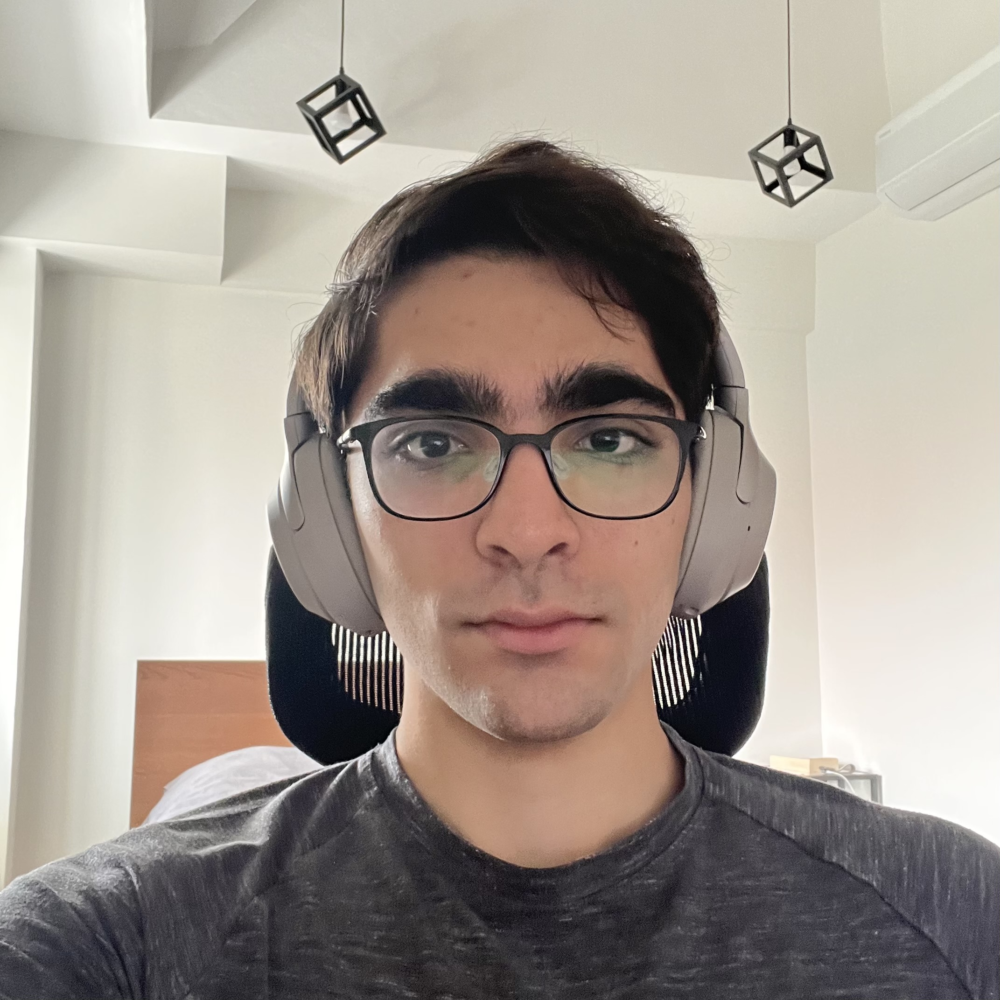
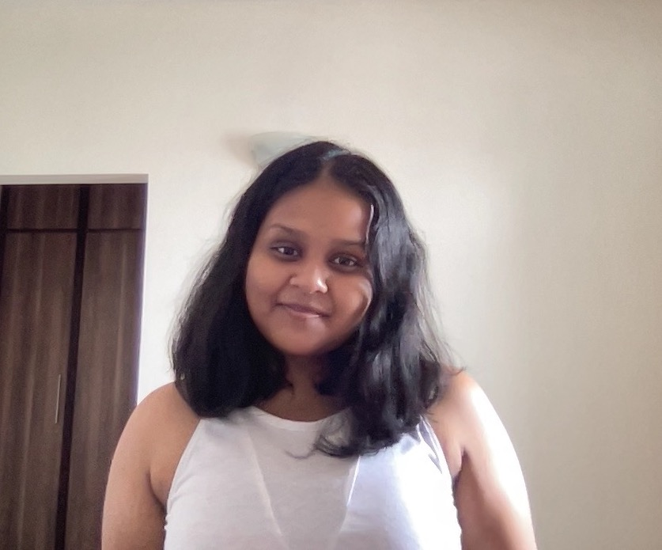
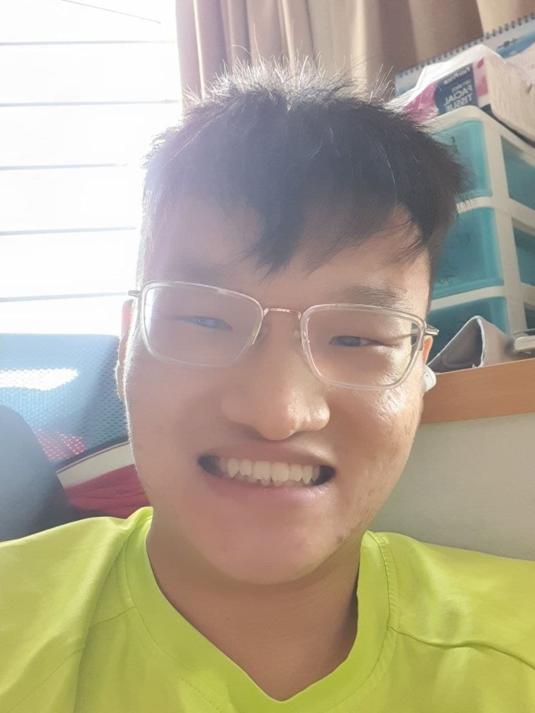

We are a team based in the [School of Computing, National University of Singapore](http://www.comp.nus.edu.sg).

You can reach us at the email `seer[at]comp.nus.edu.sg`

## Project team

### Charisma Kausar

[[homepage](https://ckcherry23.github.io)]
[[github](https://github.com/ckcherry23)]
[[portfolio](team/ckcherry23.md)]

* Role: Developer
* Responsibilities: In-charge of **Storage** and **Commons**

### Murad Durrani

[[github](http://github.com/muraddurrani)]
[[portfolio](team/muraddurrani.md)]

* Role: Developer
* Responsibilities: In-charge of **Model** and **UI**

### Tonishka Singh

[[github](http://github.com/tonishka)] [[portfolio](team/tonishka.md)]

* Role: Developer
* Responsibilities: In-charge of **Main** and **Testing**

### Nicholas Sun

[[github](http://github.com/NicsunXnus)]
[[portfolio](team/nicsunxnus.md)]

* Role: Developer
* Responsibilities: In-charge of **Parser** and **Commands**
