* Table of Contents
{:toc}

## **1. Introduction**

Reache is a desktop application that helps busy working professionals manage their large list of contacts by providing an easy-to-use interface to store contacts and organize meetings.

This Developer Guide is intended for the future software developers and designers of Reache, and serves to describe the software architecture of Reache and explain decisions made in the implementation of its features.

--------------------------------------------------------------------------------------------------------------------

## **2. Acknowledgements**

* Reache, as well as its User Guide and Developer Guide, has been adapted from AddressBook Level-3 (AB3).
  * [AB3 Repository](https://github.com/nus-cs2103-AY2122S2/tp)
  * [AB3 Product Website](https://se-education.org/addressbook-level3/)
* Libraries used: [JavaFX](https://openjfx.io/), [Jackson](https://github.com/FasterXML/jackson), [JUnit5](https://github.com/junit-team/junit5)    

--------------------------------------------------------------------------------------------------------------------

## **3. Setting up, getting started**

Refer to the guide [_Setting up and getting started_](SettingUp.md).

--------------------------------------------------------------------------------------------------------------------

## **4. Design**

:bulb: **Tip:** The `.puml` files used to create diagrams in this document can be found in the [diagrams](https://github.com/se-edu/addressbook-level3/tree/master/docs/diagrams/) folder. 

### 4.1 Architecture

The ***Architecture Diagram*** given above explains the high-level design of the App.

Given below is a quick overview of main components and how they interact with each other.

**Main components of the architecture**

**`Main`** has two classes called [`Main`](https://github.com/AY2122S2-CS2103T-W12-4/tp/blob/master/src/main/java/seedu/address/Main.java) and [`MainApp`](https://github.com/AY2122S2-CS2103T-W12-4/tp/blob/master/src/main/java/seedu/address/MainApp.java). It is responsible for,
* At app launch: Initializes the components in the correct sequence, and connects them up with each other.
* At shut down: Shuts down the components and invokes cleanup methods where necessary.

[**`Commons`**](#common-classes) represents a collection of classes used by multiple other components.

The rest of the App consists of four components.

* [**`UI`**](#ui-component): The UI of the App.
* [**`Logic`**](#logic-component): The command executor.
* [**`Model`**](#model-component): Holds the data of the App in memory.
* [**`Storage`**](#storage-component): Reads data from, and writes data to, the hard disk.

**How the architecture components interact with each other**

The *Sequence Diagram* below shows how the components interact with each other for the scenario where the user issues the command `delete 1`.

Each of the four main components (also shown in the diagram above),

* defines its *API* in an `interface` with the same name as the Component.
* implements its functionality using a concrete `{Component Name}Manager` class (which follows the corresponding API `interface` mentioned in the previous point.

For example, the `Logic` component defines its API in the `Logic.java` interface and implements its functionality using the `LogicManager.java` class which follows the `Logic` interface. Other components interact with a given component through its interface rather than the concrete class (reason: to prevent outside component's being coupled to the implementation of a component), as illustrated in the (partial) class diagram below.

The sections below give more details of each component.

### 4.2 UI component

The **API** of this component is specified in [`Ui.java`](https://github.com/AY2122S2-CS2103T-W12-4/tp/blob/master/src/main/java/seedu/address/ui/Ui.java)

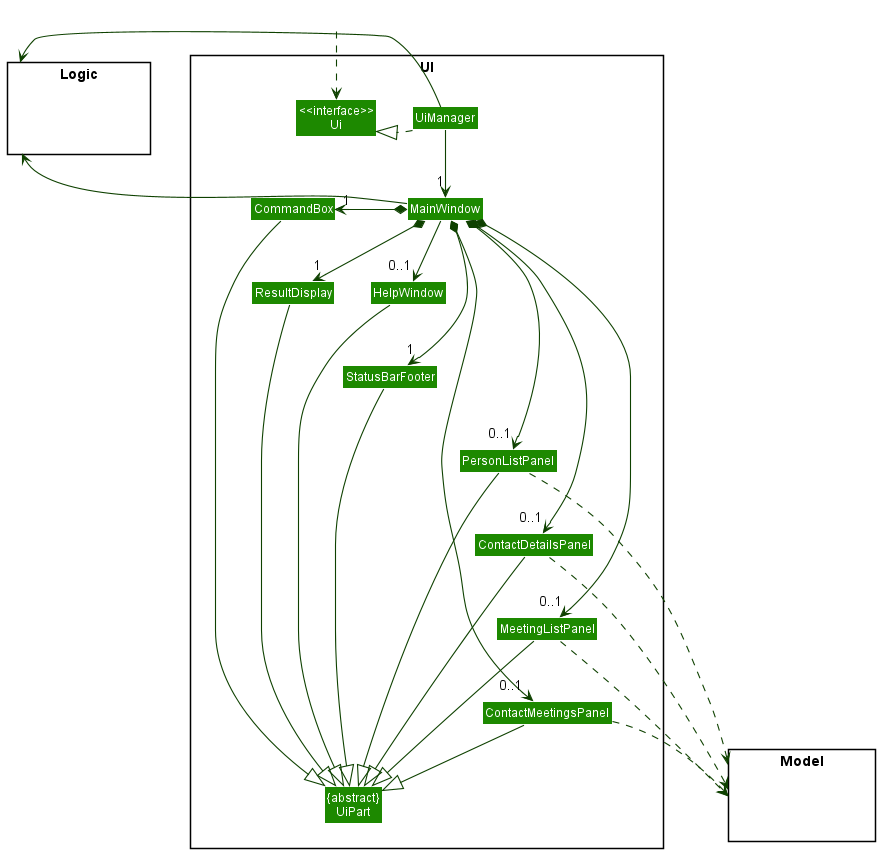

The UI consists of a `MainWindow` that comprises several UI parts. All these, including the `MainWindow`, inherit from the abstract `UiPart` class which captures the commonalities between classes that represent parts of the visible GUI.

The specific UI parts that make up the `MainWindow` depend on which page of the application is being displayed. Reache contains two pages:
* **The Home Page**: Displays lists of the user's contacts and the user's upcoming meetings. The below diagram depicts the `MainWindow` when the Home Page is being displayed.

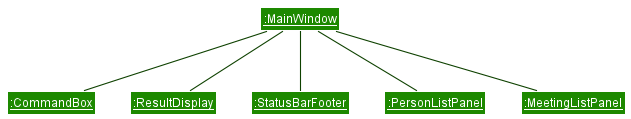

* **The Contact Details Page**: Displays the details of a specific contact, as well as upcoming meetings associated with that contact. The below diagram depicts the `MainWindow` when the Contact Details page is being displayed.

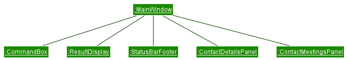

Note that the `PersonListPanel` and `MeetingListPanel` are replaced by the `ContactDetailsPanel` and `ContactMeetingsPanel` when the Contact Details Page is displayed.

The `UI` component uses the JavaFx UI framework. The layout of these UI parts are defined in matching `.fxml` files that are in the `src/main/resources/view` folder. For example, the layout of the [`MainWindow`](https://github.com/AY2122S2-CS2103T-W12-4/tp/blob/master/src/main/java/seedu/address/ui/MainWindow.java) is specified in [`MainWindow.fxml`](https://github.com/AY2122S2-CS2103T-W12-4/tp/blob/master/src/main/resources/view/MainWindow.fxml)

The `UI` component,

* executes user commands using the `Logic` component.
* listens for changes to `Model` data so that the UI can be updated with the modified data.
* keeps a reference to the `Logic` component, because the `UI` relies on the `Logic` to execute commands.
* depends on some classes in the `Model` component, as it displays `Person` object residing in the `Model`.

### 4.3 Logic component

**API** : [`Logic.java`](https://github.com/AY2122S2-CS2103T-W12-4/tp/blob/master/src/main/java/seedu/address/logic/Logic.java)

Here's a (partial) class diagram of the `Logic` component:

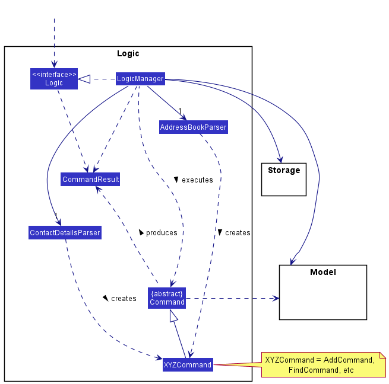

How the `Logic` component works:
1. When `Logic` is called upon to execute a command, it uses one of two parsers to process the user command. If the command is entered from the Home Page, it is parsed by `HomePageParser`. If it is entered from the Contact Details Page, it is parsed by `ContactDetailsPageParser`.
2. This results in a `Command` object (more precisely, an object of one of its subclasses e.g., `AddCommand`) which is executed by the `LogicManager`. The only commands whose creation is specific to the `ContactDetailsPageParser` class are the `EditCommand` ,`DeleteFieldCommand` and `BackCommand`  classes. General commands applicable to both parsers are the `ExitCommand` and `HelpCommand` classes. 
3. The command can communicate with the `Model` when it is executed (e.g. to add a person).
4. The result of the command execution is encapsulated as a `CommandResult` object which is returned back from `Logic`.

The Sequence Diagram below illustrates the interactions within the `Logic` component for the `execute("delete 1")` API call.

:information_source: **Note:** The lifeline for `DeleteCommandParser` should end at the destroy marker (X) but due to a limitation of PlantUML, the lifeline reaches the end of diagram.

Here are the other classes in `Logic` (omitted from the class diagram above) that are used for parsing a user command:

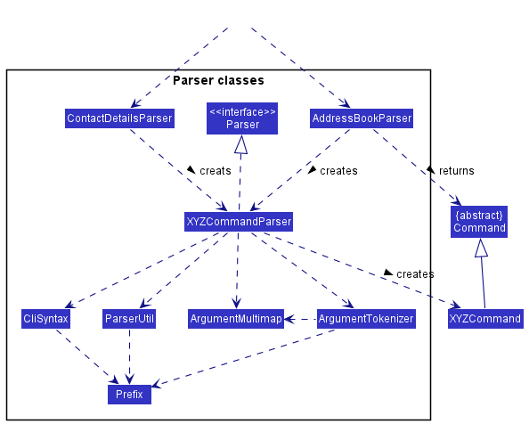

How the parsing works:
* When called upon to parse a user command, the `HomePageParser` or `ContactDetailsPageParser` class creates an `XYZCommandParser` (`XYZ` is a placeholder for the specific command name e.g., `AddCommandParser`) which uses the other classes shown above to parse the user command and create a `XYZCommand` object (e.g., `AddCommand`) which the `HomePageParser` returns back as a `Command` object.
* All `XYZCommandParser` classes (e.g., `AddCommandParser`, `DeleteCommandParser`, ...) inherit from the `Parser` interface so that they can be treated similarly where possible e.g, during testing.

### 4.4 Model component
**API** : [`Model.java`](https://github.com/AY2122S2-CS2103T-W12-4/tp/blob/master/src/main/java/seedu/address/model/Model.java)

We have divided the class diagram of the `Model` component into two parts for better understandability.  
The first diagram below illustrates the `Model` component's structure for storing `Person` objects.

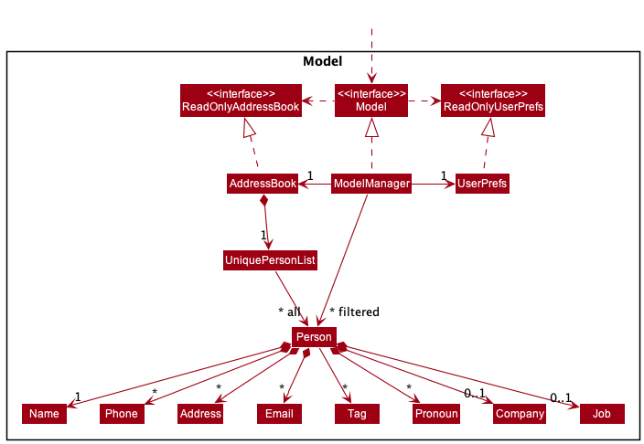

The second diagram below illustrates the `Model` component's structure for storing `Meeting` objects. It is worthwhile to note that `Meeting` objects are associated to `Id` objects (each `Id` uniquely identifies each `Person`) so that updates to `AddressBook` do not affect the list of people in a `Meeting`.

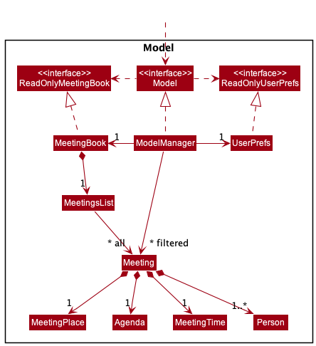

The `Model` component,

* stores the address book data i.e., all `Person` objects (which are contained in a `UniquePersonList` object).
* stores the meeting book data i.e., all `Meeting` objects (which are contained in a `MeetingsList` object).
* stores the currently 'selected' `Person` objects (e.g., results of a search query) as a separate _filtered_ list which is exposed to outsiders as an unmodifiable `ObservableList<Person>` that can be 'observed' e.g. the UI can be bound to this list so that the UI automatically updates when the data in the list change.
* stores a `UserPref` object that represents the user’s preferences. This is exposed to the outside as a `ReadOnlyUserPref` objects.
* does not depend on any of the other three components (as the `Model` represents data entities of the domain, they should make sense on their own without depending on other components)

### 4.5 Storage component

**API** : [`Storage.java`](https://github.com/AY2122S2-CS2103T-W12-4/tp/blob/master/src/main/java/seedu/address/storage/Storage.java)

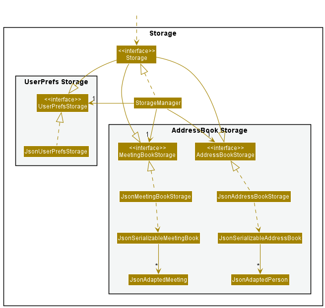

Here are the other classes that were omitted from the diagram above but are useful to take note of:

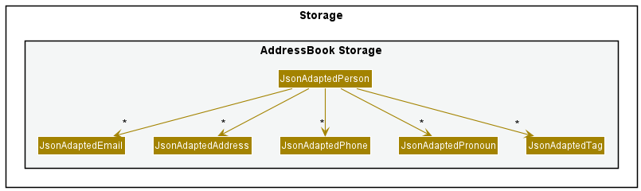

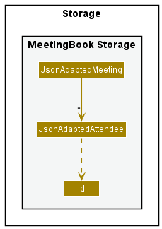

The `Storage` component,
* can save both address book, meeting book and user preference data in json format, and read them back into corresponding objects.
* inherits from `AddressBookStorage`, `MeetingBookStorage` and `UserPrefStorage`, which means it can be treated as either one (if only the functionality of only one is needed).
* depends on some classes in the `Model` component (because the `Storage` component's job is to save/retrieve objects that belong to the `Model`)

### 4.6 Common classes

Classes used by multiple components are in the `seedu.addressbook.commons` package.

--------------------------------------------------------------------------------------------------------------------

## **5. Implementation**

This section describes some noteworthy details on how certain features are implemented.

### 5.1 General Design Considerations
Listed below are a few significant decisions we made in designing Reache, and their implications for program use.

* **Decision**: Allow the user to store the same phone number twice under different labels. For example, A contact can have one instance of the number "87654321" saved with the label "Personal" and one instance saved with the label "Office".
  * Pros:
    * The user may wish to make explicit that a contact uses the same number for two purposes

  * Cons:
    * Presents the risk of the user accidentally storing the same number twice. An occurrence of this accident would be relatively easy to spot on the Contact Details Page, where all numbers appear in a list

 

* **Decision**: Allow multiple contacts to have the same name, so long as their tags differ.
  * Pros:
    * If the user does know two people that share the same full name, they can include them both in their contact list without conflict by giving each person different tags
  * Cons:
    * The user may accidentally add the same contact twice. This risk is partially alleviated by the need for different tags, and because contacts are sorted alphabetically, an occurrence of this accident would be relatively easy to spot

 

* **Decision**: Allow phone numbers to be of varying lengths, as long as they are over 3 digits.
  * Pros:
    * Different countries have different standard phone number lengths, so allowing different lengths makes Reache more suitable for international users
  * Cons:
    * In Singapore, where the application was developed, the lack of restriction on phone number length could give rise to user mistakes

  
### 5.2 Edit feature
The edit mechanism is a feature used to change the details of a contact. It is only accessible from the Contact Details Page, and so must be preceded by an _add_ or _view_ command, both of which navigate the user to the Contact Details Page. It is facilitated mainly by the `ContactDetailsPageParser`, `EditCommandParser` and `EditCommand` classes.

The following sequence diagram shows how the edit operation works:

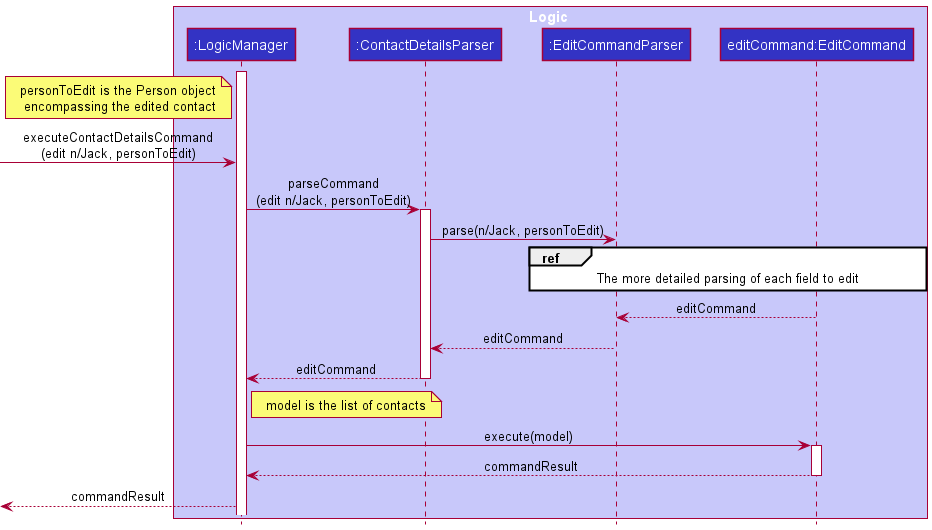
- Here, the user executes an `EditCommand`, and supplies the argument `n/Jack`, meaning they wish to change the name of `personToEdit` to "Jack".

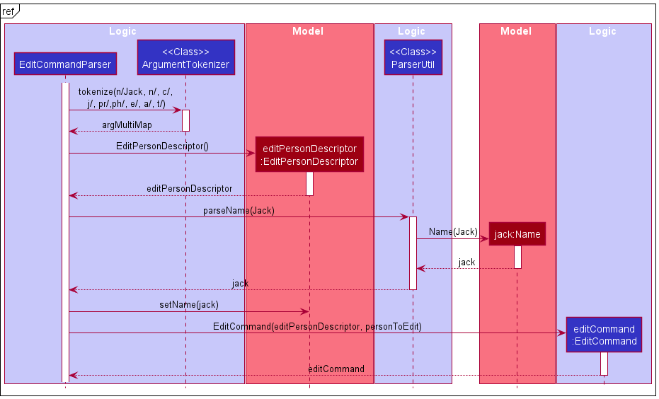

Below is an activity diagram summarising the possible paths leading to and during the execution of an `EditCommand`:

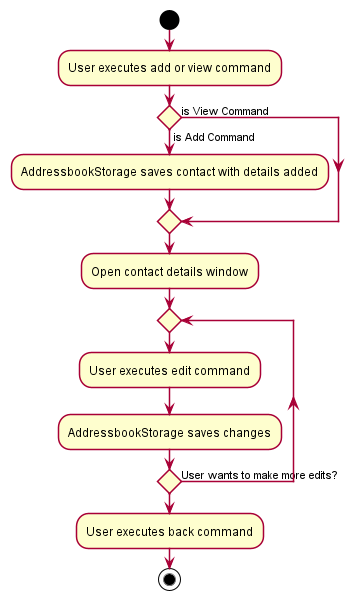

:information_source: **Note:** Similar to adding a contact, the contact edited cannot have the same **Name** and **Tags** as an existing contact in the addressbook. This is meant to protect against duplicate contacts which may result in confusion for the user in managing their contacts. Attempting to do so will result in a warning message to the user which reads "A person with these details already exists. Please do add tags that differentiate between them!"

#### 5.2.1 Design considerations:

**Aspect: How edit saves:**

* **Alternative 1 (current choice):** Each edit is saved immediately.
    * Pros: Prevents data loss from system crashes.
    * Cons: May have performance issues in terms of memory usage.

* **Alternative 2 :** All edits are saved only after executing a save command (not implemented feature).
    * Pros: Allows user to revert their changes
    * Cons: System crashes will not save the edits.

We chose to use alternative 1 in our implementation because in manually using the application and assessing its performance, we found that manually saving after every edit did not make a meaningful difference to performance and would not affect user experience.

### 5.3 Delete fields feature
The **delete fields** feature can be used to delete fields stored for the contacts. 
This feature is also restricted to the Contact Details Page, 
which can be accessed after the _add_ or _view_ commands. 
It is mainly facilitated by the `ContactDetailsPageParser`, `DeleteFieldCommandParser` and `DeleteFieldCommand` classes.

_Note:_ This feature is different from the **delete contacts** feature, 
which is only accessible on the Home Page.

#### 5.3.1 Design considerations:
Since certain fields allow for multiple values to be stored, 
the user needs to specify the label of the value (or the value itself for non-labelled fields) 
they want to delete along with the field to be deleted for such fields.

**Aspect: What happens when the user does not specify a label or value:**

* **Alternative 1 (current choice):** Delete all the values stored for this field immediately.
    * Pros:
      * Seems to be the most intuitive approach.
      * Easier to implement.
      * Faster to execute command.
    * Cons:
      * User may have forgotten to mention the label or field, which could lead to unintended loss of data.

* **Alternative 2 :** Confirm that the user wants to delete all values for this field
    * Pros:
      * Allows user to cancel the command if it was unintentional.
    * Cons:
      * Slower to execute command.
      * Difficult to implement, since the current implementation does not store command history.

We picked _alternative 1_ since the focus of our CLI app is on speed and efficiency. 
Additionally, _alternative 2_ required a lot of changes to the existing implementation which would not be 
very helpful for executing other commands.

### 5.4 Clear all data feature
The **clear all data** feature can be used to delete all the contacts 
and meetings stored by the user. Since deleted data cannot be recovered, 
the app opens a pop-up window asking for user confirmation before any 
data is cleared.

The following sequence diagram shows how the clear operation works:

This activity diagram summarises the possible paths of executing the _clear_ 
command:

### 5.5 View feature

The `view` feature allows the user to view the contact details of a specified person in the address book, as well as meetings the user has with that person. The command is only available from the Home Page, and is facilitated by the `HomePageParser`, `ViewCommandParser`, and `ViewCommand`. Additionally, it implements the following operation:

* `MainWindow#LoadContactDetailsPage(Person personToDisplay)` — Constructs a `ContactDetailsPanel` and a `ContactMeetingsPanel` for the specified `personToDisplay`,and displays them in the `MainWindow`.

Given below is an example usage scenario and how the _view_ mechanism behaves at each step.

Step 1. From the Home Page, the user executes `view 2` to view the contact details of the second person in the address book. A `ViewCommand` is constructed with the index of the person to de displayed.

Step 2. The `ViewCommand` is executed, and the person that corresponds to the provided index is returned to `MainWindow` inside a `CommandResult`.

Step 3. `MainWindow#loadContactDetailsPage(Person personToDisplay)` is executed with the specified person passed as argument, which constructs and displays the respective `ContactDetailsPanel` and `ContactMeetingsPanel`.

The following sequence diagram shows how the _view_ feature works:

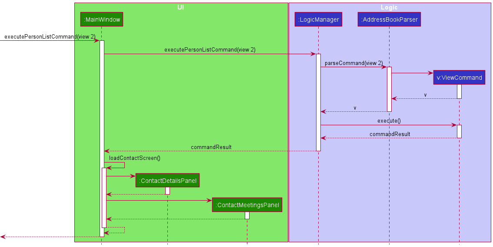

#### 5.5.1 Design considerations:

**Aspect: Where to display a person's contact details:**

* **Alternative 1:** Display all contact information in the Home Page.
  * Pros:
    * Easy to implement
    * Requires fewer commands from the user as they do not need to navigate to a new screen to view a contact's information
  * Cons:
    * Between phone numbers, emails, addresses, job titles, and more, a contact can have a large amount of information associated with it. Displaying all that information in the Home Page would add a lot of clutter
    
* **Alternative 2 (current choice):** Navigate to a new screen to for contact information
  * Pros:
    * Greatly reduces clutter in the Home Page
    * Reduces the length of the contact list, making it easier and faster to scroll through
  * Cons:
    * More difficult to implement
    * Requires an additional command from the user to both view a contact's information and return to the Home Page after
    
We chose alternative 2 for two reasons:
* Its benefit to the visual clarity of the address book and thus the ease of its use outweighs the cost of including an additional navigation step
* Given the quantity of information a contact can have associated with it, having to scroll through a cluttered and much longer list could take the user more time than simply navigating to a new page

### 5.6 Find feature

The `find` command is used to search people's contact information for a particular keyword. It takes an optional argument which is the
field that the user wishes to search. The `find` command is mainly facilitated by the `FindCommand`, `FindCommandParser`, and 
`FieldContainsKeywordsPredicate` classes.

Below is a sequence diagram summarising the mechanism of the _find_ command:

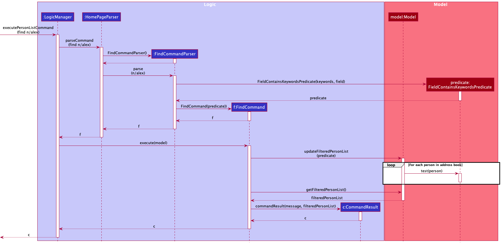

Below is an activity diagram summarising the possible paths for a `find` command:

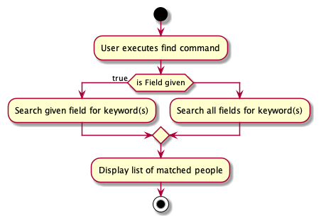

#### 5.6.1 Design Considerations

**Aspect: How keywords are matched**

* **Alternative 1 (Current Choice):** Ignore case and full match is required  
  - Pros:
    - Easy to implement. 
    - It gives the best performance if the user remembers the exact keyword they are searching for.
  - Cons: Weak matching, i.e., `abc` does not match with `ab`. The current implementation would be less useful if the user 
  remembers only some part of the search keywords.

* **Alternative 2:** Ignore case but full match is not required  
    - Pros: Strong matching, would be especially helpful if the user remembers only bits and pieces of search keywords.
    - Cons: Difficult and time-consuming to implement.

**Aspect: What happens when user does not specify a field**

**Note:**   
For evaluating the usefulness of the alternatives these are the assumptions made as to why the user does not specify 
the field:  
a) they forgot,  
b) they do not want to restrict their search to one field, or  
c) they do not remember which field they want to search.

* **Alternative 1 (Current Choice):** Search all fields for the keyword  
  - Pros:
    - This is the most intuitive approach. 
    - For all above mentioned scenarios a-c, this alternative is will produce the most useful result.
  - Cons:
    - If there is a lot of data it will take more time to search all fields for every person.
    - Requires the most complex implementation among all alternatives. 
    - Performs a lot of unnecessary comparisons (`alex` will never match any phone number, likewise `659347563` will 
    never match any name). 

* **Alternative 2:** Use name as the default search field
  - Pros: Simple implementation. Since searching people by their name is the most probable and intuitive use of this command, this is likely to produce a useful result.
  - Cons: Useless for scenario b) and c).

* **Alternative 3:** Produce a command syntax error and ask user to enter field
  - Pros: Simple implementation. Useful in scenario a) above.
  - Cons: Useless for scenario b) and c).

### 5.7 Meet Feature

The `meet` feature allows the user to schedule meetings having an `Agenda`, a `Meeting Time`, a `Meeting Place`, and 
`Meeting Attendees`. The `meet` command can only be issued from the `Home Page`. It is facilitated by such classes as
`HomePageParser`, `MeetCommandParser`, and `MeetCommand`.

Below is a sequence diagram summarising the mechanism of the `meet` feature:

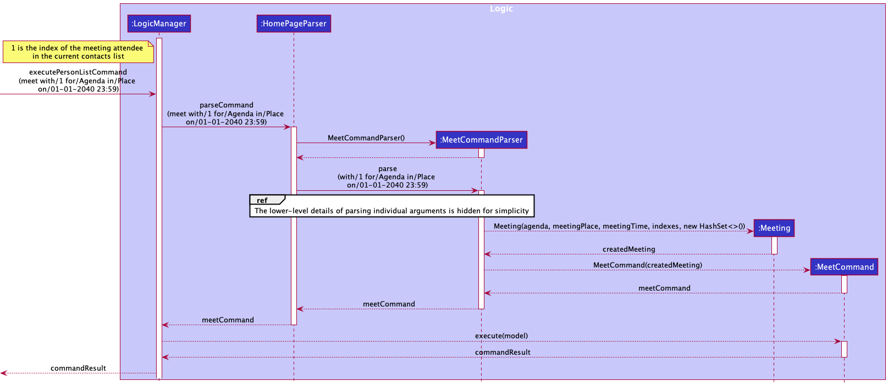

#### 5.7.1 Design Considerations

#### Aspect: Creation of multiple meetings at the same time
* **Alternative 1 (Current Choice):** Multiple different meetings can be created at the same time
  * Pros: 
    * Gives the user greater flexibility in deciding their schedule. 
    * When users have conflicting meetings, they should have the 
    freedom to add both of them to Reache and decide later which one they want to attend. 
    * It is also possible that some users may
    attend more than one meeting simultaneously (such as when they are online). 
  * Cons: Users may unknowingly add conflicting meetings.
* **Alternative 2:** Only one meeting is allowed to be created at a given time
  * Pros: Prevents the user from unknowingly adding conflicting meetings.
  * Cons: 
    * Affords the user less flexibility in deciding their schedule. 
    * If a user wants to schedule multiple meetings but decide
    later which ones they want to keep, they are unable to do so. The user will have to go through the additional step of cancelling 
    the original meeting first before scheduling another at the same time.

#### Aspect: Specifying the domain of meeting attendees
* **Alternative 1 (Current Choice):** Only people whose have been added to Reache can be attendees in a meeting
  * Pros: 
    * Compels the user to be proactive in adding their contacts to Reache. 
    * If the user enters a non-existent index they are alerted of the fact and can rectify the command by adding valid
    attendees.
  * Cons:
    * User will have to add all attendees to Reache before they can schedule a meeting with them.
* **Alternative 2:** Anyone can be an attendee, but those who have not been added will be listed as `Unknown Attendee`
  * Pros: 
    * The users can add attendees to meetings that do not yet exist in Reache.
  * Cons:
    * If the user makes a genuine mistake of specifying a non-existent index, Reache will not alert the user of their error and instead create
    a meeting with an `Unknown Attendee`. This will lead to the wrong attendees being associated with a meeting.
    
#### Aspect: What happens when a meeting attendee is deleted 
* **Alternative 1 (Current Choice):** The `Meetings` panel will show the attendee as `Unknown Attendee` in the meeting description 
  * Pros: The user has a visual indication that they have deleted the contact information of a potentially relevant person.
  * Cons: More challenging to implement than **Alternative 2**.
* **Alternative 2:** The `Meetings` panel will not show any information about the attendee in the meeting description
  * Pros: Easy to implement.
  * Cons: Mislead the user about the number of attendees in the meeting. 

#### Aspect: What happens to meetings once they are expired
* **Alternative 1 (Current Choice):** Expired meetings are removed from the `Meetings` panel everytime the application is loaded
  * Pros: 
    * Prevents cluttering in the `Meetings` panel by removing meetings that are irrelevant.
    * User does not have to go through the additional step of cancelling each expired meeting to prevent cluttering.
  * Cons:
    * Users will be unable to see the details of past meetings if they wish to do so.
* **Alternative 2:** Expired meetings are not removed from the `Meetings` panel
  * Pros: 
    * Users can see details of their past meetings.
  * Cons:
    * Leads to cluttering in the `Meetings` panel.
    * Meetings are shown to the user in a chronological order so that they can see their upcoming schedule. Not automatically removing expired meetings will
      lead to loss of utility because the user has to scroll through countless expired meetings to find their upcoming schedule.

### 5.8 Update Feature

The `update` feature allows the user to update the details of the meetings that they have scheduled. The `update` command can only be issued from the `Home Page`. It is facilitated by such classes as
`HomePageParser`, `UpdateCommandParser`, and `UpdateCommand`.

Below is a sequence diagram summarising the mechanism of the `update` feature:

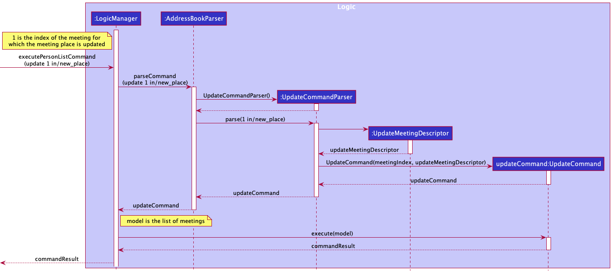

#### 5.8.1 Design Considerations

The important design decisions made for `update` command are the same as design decisions made for `meet` command above.
Meetings updated using the `update` command are subject to the same constraints as if they were added directly using the `meet` command. 

--------------------------------------------------------------------------------------------------------------------

## **6. Documentation, logging, testing, configuration, dev-ops**

* [Documentation guide](Documentation.md)
* [Testing guide](Testing.md)
* [Logging guide](Logging.md)
* [Configuration guide](Configuration.md)
* [DevOps guide](DevOps.md)

--------------------------------------------------------------------------------------------------------------------

## **7. Appendix: Requirements**

### 7.1 Product scope

**Target user profile**:

* really busy working professional
* has a need to manage a significant number of contacts
* prefer desktop apps over other types
* can type fast
* prefers typing to mouse interactions
* is reasonably comfortable using CLI apps

**User persona**:

**Value proposition**: 

We help _busy working professionals_ manage their large list of contacts by providing an **easy-to-use interface to store contacts** and help organize meetings. Our product will help users organize contacts by their companies, job titles, etc., and navigate their professional network quickly and efficiently to find who they are looking for. 

### 7.2 User stories

Priorities: 
- High (must-have) - `* * *`
- Medium (nice-to-have) - `* *`
- Low (unlikely-to-have) - `*`

| Priority | As a …​              | I want to …​                                                     | So that I can…​                                                                    |
| -------- | ----------------------- | ------------------------------------------------------------------- | ------------------------------------------------------------------------------------- |
| `* * *`  | new user                | view a help page with commands and usage instructions               | understand how to use the application                                                 |
| `* * *`  | user                    | add a new person to the contact list                                | expand my contacts list                                                               |
| `* * *`  | user                    | delete a person from the contact list                               | remove contacts I no longer require                                                   |
| `* * *`  | user                    | label and store a person's phone numbers                            | know how to contact them via phone and which number to use (personal, office, etc.)   |
| `* * *`  | user                    | label and store a person's email addresses                          | know how to contact them via email and which email to use (personal, office, etc.)    |
| `* * *`  | user                    | label and store a person's addresses                                | know how to find them via address and which address to use (home, office, etc.)       |
| `* * *`  | user                    | store a person's company                                            | check which company they work at                                                      |
| `* * *`  | user                    | store a person's job title                                          | check what job they have                                                              |
| `* * *`  | user                    | store a person's pronouns                                           | check how they prefer to be addressed                                                 |
| `* * *`  | user                    | assign custom tags to a person                                      | identify them by the tags I give them                                                 |
| `* * *`  | user                    | edit a person's contact information                                 | update their contact information without having to delete and create a new contact    |
| `* * *`  | user                    | delete all contacts from the contact list                           | remove all contacts when I no longer require them and start with a fresh contact list |
| `* * *`  | user                    | view all my contacts as a list                                      | scroll the list to view all contacts or find the one I want                           |
| `* * *`  | user                    | save my data automatically                                          | reduce the risk of my data being lost                                                 |
| `* * *`  | user                    | create a meeting with my contacts                                   | plan and keep track of meetings I have with my contacts                               |
| `* * *`  | user                    | store the agenda of a meeting                                       | remember what the purpose of the meeting is                                           |
| `* * *`  | user                    | store the time of a meeting                                         | remember when the meeting is taking place                                             |
| `* * *`  | user                    | store the location of a meeting                                     | remember where the meeting is taking place                                            |
| `* * *`  | user                    | cancel a meeting                                                    | remove meetings I no longer need to track                                             |
| `* * *`  | user                    | update a meeting                                                    | change details about the meeting without having to delete it and create a new one     |
| `* * *`  | user                    | view all my meetings as a list                                      | scroll the list to view all my meetings                                               |
| `* * *`  | user                    | view my meetings in chronological order                             | see my most urgent meetings first                                                     |
| `* * *`  | advanced user           | save all my contacts in an editable file                            | edit my contacts directly from the data file                                          |
| `* *`    | user                    | find meetings I have with a specific contact                        | know what meetings I have with that person                                            |
| `* *`    | new user                | be provided suggested commands when I am adding contact information | know what kind of information I am able to add                                        |
| `* *`    | new user                | view sample contacts when I first launch the application            | see how the application looks when in use                                             |
| `* *`    | new user                | easily remove existing sample contact information                   | begin adding my own contacts without confusion                                        |
| `* *`    | user                    | be warned when I create a contact with a name that exists           | make sure I do not accidentally create a duplicate contact                            |
| `* *`    | user with many contacts | search for a contact by name                                        | find the contact I am looking for without having to scroll through a long list        |
| `* *`    | user with many contacts | search for a contact by their contact information                   | find the person I am looking for when I do not remember their name                    |
| `*`      | user                    | change the colour scheme of the application                         | personalise my experience                                                             |
| `*`      | user                    | be able to undo my previous command                                 | undo a command if I make a mistake                                                    |
| `*`      | user                    | save my contacts' addresses as Google Maps links                    | use Google Maps for directions                                                        |
| `*`      | user                    | see information about my business dealings with my contacts         | continue my business with them                                                        |
| `*`      | user with many contacts | be provided a history of my most searched-for contacts              | easily find the contacts I use more often                                             |
| `*`      | user with many contacts | access my recent search history                                     | can easily search for a previously searched contact                                   |

### 7.3 Use cases

(For all use cases below, the **System** is the `Reache` and the **Actor** is the `user`, unless specified otherwise)

**Use case: UC1 - Add a contact**

**MSS:**

1. User requests to add a contact by their name.  
2. Reache goes into ‘edit’ mode.  
3. User <ins>edits the contact’s details (UC2)</ins>.  
4. Reache displays the newly added contact in the list of contacts.  
Use case ends.

**Extensions:**  

1a. User inputs using the wrong format.  
&emsp; 1a1. Reache displays an error message.  
&emsp; Use case resumes from step 1.  

2a. Reache informs that the contact name already exists  
Use case resumes at step 1.  

 

**Use case: UC2 - Edit contact details**

**MSS:**

1. User requests to add details for specific field(s) of the contact.  
2. Reache saves the specified details along with their respective field(s).  
&emsp;Repeat steps 1 and 2 until satisfied.  
3. User requests to leave ‘edit’ mode.  
4. Reache returns to ‘default’ mode.  
Use case ends.

**Extensions:**  

1a. User inputs the wrong format.  
&emsp; 1a1. Reache displays an error message.  
&emsp; Use case resumes from step 1.

2a. Reache informs that the contact name already exists  
Use case resumes at step 1.  

 

**Use case: UC3 - Delete a contact**

**MSS:**

1. User requests to delete a contact.  
2. Reache deletes the contact.  
Use case ends.

**Extensions:**

1a.  The requested contact does not exist.  
&emsp; 1a1. Reache displays an error message.  
&emsp; Use case resumes at step 1.

 

**Use case: UC4 - Find contacts by field**

**MSS:**

1. User requests to find contacts by a given value for a field.  
2. Reache shows all contacts that match the find criterion.  
Use case ends.

**Extensions:**

1a. No contacts match the find criterion.  
&emsp; 1a1. Reache alerts that no contacts were found.  
&emsp; Use case ends.

 

**Use case: UC5 - View contact's full details**

**MSS:**

1. User requests to view a contact's full details.  
2. Reache displays the contact's full details.  
Use case ends.

**Extensions:**

1a.  The requested contact does not exist.  
&emsp; 1a1. Reache displays an error message.  
&emsp; Use case resumes at step 1.

 

**Use case: UC6 - List all contacts**

**MSS:**

1. User requests to see a list of all contacts.  
2. Reache displays the list.  
Use case ends.

**Extensions:**

1a. There are no contacts.  
&emsp; 1a1. Reache alerts that contact list is empty.  
&emsp; Use case ends.

 

**Use case: UC7 - Clear all contacts and meetings**

**MSS:**

1. User requests to clear the contacts.  
2. Reache asks for confirmation.  
3. User confirms the action.  
4. Reache clears all contacts and meetings.  
Use case ends.

**Extensions:**

1a. User requests to list all contacts.  
&emsp; 1a1. Use case resumes from step 1.   

3a.  User chooses to cancel clearing contacts.  
&emsp; 3a1. Reache cancels the clearing.  
&emsp; Use case ends.

 

**Use case: UC8 - Add a meeting**

**MSS:**

1. User requests to add a meeting with details.  
2. Reache displays the newly added meeting in the list of meetings.  
Use case ends.

**Extensions:**  

1a. User inputs using the wrong format.  
&emsp; 1a1. Reache displays an error message.  
&emsp; Use case resumes from step 1.  

2a. Reache informs that the meeting with a same date and time already exists.  
Use case resumes at step 1.  

 

**Use case: UC9 - Edit meeting details**

**MSS:**

1. User requests to add details for specific field(s) of the meeting.  
2. Reache saves the specified details along with their respective field(s).  
Use case ends.

**Extensions:**  

1a. User inputs the wrong format.  
&emsp; 1a1. Reache displays an error message.  
&emsp; Use case resumes from step 1.

2a. Reache informs that the meeting with a same date and time already exists.  
Use case resumes at step 1.  

 

**Use case: UC10 - Delete a meeting**

**MSS:**

1. User requests to delete a meeting.  
2. Reache deletes the meeting.  
Use case ends.

**Extensions:**

1a.  The requested meeting does not exist.  
&emsp; 1a1. Reache displays an error message.  
&emsp; Use case resumes at step 1.

 

**Use case: UC11 - Clear all meetings**

**MSS:**

1. User requests to clear all meetings  
2. Reache asks for confirmation.  
3. User confirms the action.  
4. Reache clears all meetings.  
Use case ends.

**Extensions:**

3a.  User chooses to cancel clearing contacts.  
&emsp; 3a1. Reache cancels the clearing.  
&emsp; Use case ends.

### 7.4 Non-Functional Requirements

**Technical requirements:**

1.  The product should work on any _mainstream OS_ as long as it has Java `11` installed.

**Quality requirements:**

1.  A user with above average typing speed for plain English text should be able to accomplish most of the tasks using commands faster than with the mouse.

**Testability requirements:**

1.  The product should be only for a single user for higher testability.

**Data requirements:**

1. Data should be stored locally and on a human-editable file.

2. The final JAR file size should not exceed 100MB.

3. The PDF file size for the DG and UG should not exceed 15 MB per file.

**Usability requirements:**

1. The DG and UG must be PDF-friendly. 

2. The GUI should not cause any resolution-related inconveniences to the user for:
    1. standard screen resolutions 1920x1080 and higher
    2. screen scales 100% and 125%.
    
    In addition, all functions in the GUI should be usable even if the user experience is not optimal for:
    1. resolutions 1280x720 and higher 
    2. screen scales 150%.

### 7.5 Glossary

* **Mainstream OS:** Windows, MacOS, Linux
* **Busy working professionals:** Someone who has to manage a large number of 
interpersonal relationships for success at work and life
* **Personal and professional network:** Friends, family, neighbors, acquaintances, 
co-workers, clients, mentors, mentees

--------------------------------------------------------------------------------------------------------------------

## **8. Appendix: Instructions for manual testing**

Given below are instructions to test the app manually.

:information_source: **Note:** These instructions only provide a starting point for testers to work on;
testers are expected to do more *exploratory* testing.

### 8.1 Launch and shutdown

1. Initial launch

   1. Download the jar file and copy into an empty folder

   1. Double-click the jar file Expected: Shows the GUI with a set of sample contacts. The window size may not be optimum.

1. Saving window preferences

   1. Resize the window to an optimum size. Move the window to a different location. Close the window.

   1. Re-launch the app by double-clicking the jar file. 
       Expected: The most recent window size and location is retained.
      
### 8.2 Adding a person

### 8.3 Editing a person

### 8.4 Deleting a field

### 8.5 Deleting a person

1. Deleting a person while all persons are being shown

   1. Prerequisites: List all persons using the `list` command. Multiple persons in the list.

   1. Test case: `delete 1` 
      Expected: First contact is deleted from the list. Details of the deleted contact shown in the status message. Timestamp in the status bar is updated.

   1. Test case: `delete 0` 
      Expected: No person is deleted. Error details shown in the status message. Status bar remains the same.

   1. Other incorrect delete commands to try: `delete`, `delete x`, `...` (where x is larger than the list size) 
      Expected: Similar to previous.

### 8.6 Clearing contacts and/or meetings

### 8.7 Finding

### 8.8 List

### 8.9 View

### 8.10 Back

### 8.11 Adding a meeting

1. Adding a meeting
   
   1. Prerequisites: Have an empty meeting list and 1 contact in the contacts list. The list of test cases have to be followed in order for the testing to work.

   2. Test case: `meet with/1 for/Product Demo in/Conference Room 5A on/05-04-2025 15:44`  
      Expected: The added meeting is shown on the list of meetings at the side and a success message is displayed.
   
   3. Test case: `meet with/2 for/Product Demo in/Conference Room 5A on/05-04-2025 15:44`  
      Expected: No meeting is added and an error message is shown in the status box.
   
   4. Test case: `meet with/1 for/Product Demo in/Conference Room 5A on/05-04-2025 15:44`  
      Expected: No meeting is added and an error message is shown in the status box.
   
   5. Test case: `meet with/ for/Product Demo in/Conference Room 5A on/05-04-2025 15:44`  
      Expected: No meeting is added and an error message is shown in the status box.
   
   6. Test case: `meet with/1 for/ in/Conference Room 5A on/05-04-2025 15:44`  
      Expected: No meeting is added and an error message is shown in the status box.
   
   7. Test case: `meet with/1 for/Product Demo in/ on/05-04-2025 15:44`  
      Expected: No meeting is added and an error message is shown in the status box.
   
   8. Test case: `meet with/1 for/Product Demo in/Conference Room 5A on/`  
      Expected: No meeting is added and an error message is shown in the status box.
   
   9. Test case: `meet with/1 for/Product Demo in/Conference Room 5A on/2025-05-04 15:44`
      Expected: No meeting is added and an error message is shown in the status box.

### 8.12 Updating a meeting

### 8.13 Cancelling a meeting

1. Canceling a meeting

   1. Prerequisites: Must have only one meeting added in the `Meetings` list
   
   2. Test case: `cancel 2`  
      Expected: No meeting is cancelled and an error message is shown in the status box.
   
   3. Test case: `cancel 1`  
      Expected: The meeting is cancelled and disappears from the `Meetings` list.

### 8.14 Saving data

1. Dealing with missing/corrupted data files

   1. Prerequisite for each test case: Must have at least one contact stored in `data/addressbook.json` and one meeting 
      stored in `data/meetingbook.json`. You can add this data to the files by using the `add` and `meet` commands on 
      the Reache application.
   
   2. Test case: Delete the `addressbook.json` file and run the program.  
      Expected: The application will start with both sample contacts and a sample meeting.
   
   3. Test case: Delete the `meetingbook.json` file and run the program.  
      Expected: The application will retain its stored contacts but the meetings list will be empty.
   
   4. Test case: Add a valid phone number (more than 3 digits) with any non-empty label in `addressbook.json` for an 
      existing contact and run the program. For example, you can add `"Landline": "32449877"`.
   
      

        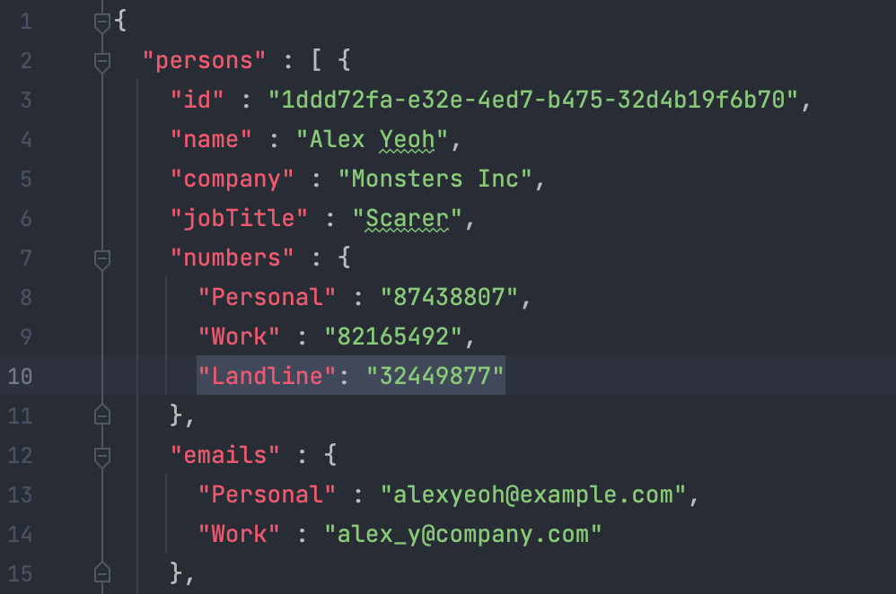
      

   
      Expected: The application will have the new number associated with the contact it was added to. You can verify 
      this by using the `view` command on the contact you added the phone number to and checking their numbers list.
   
   5. Test case: Add an invalid phone number (having alphabets and symbols) with any label in `addressbook.json` for an 
      existing contact and run the program. For example, you can add `"Landline": "landline number"`.  
      Expected: The application will discard all existing data and start without any stored contacts or meetings.
   
   6. Test case: Remove the attendees of an existing meeting in `meetingbook.json`.

      

        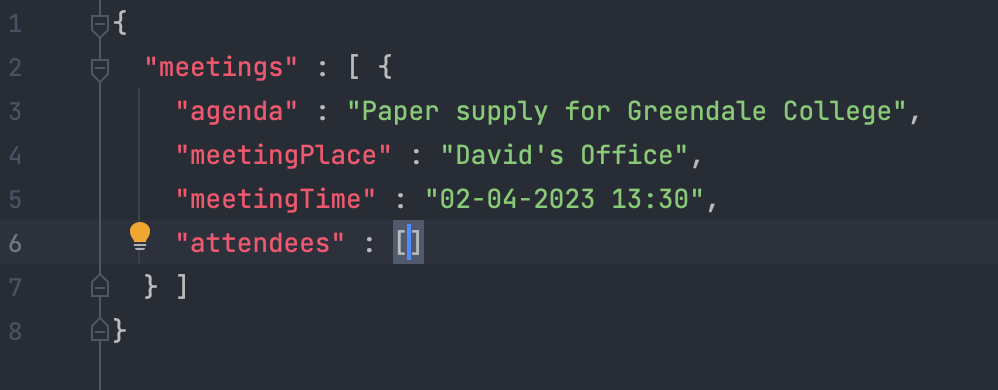
      

   
      Expected: The application will discard all existing data and start without any stored contacts or meetings.
