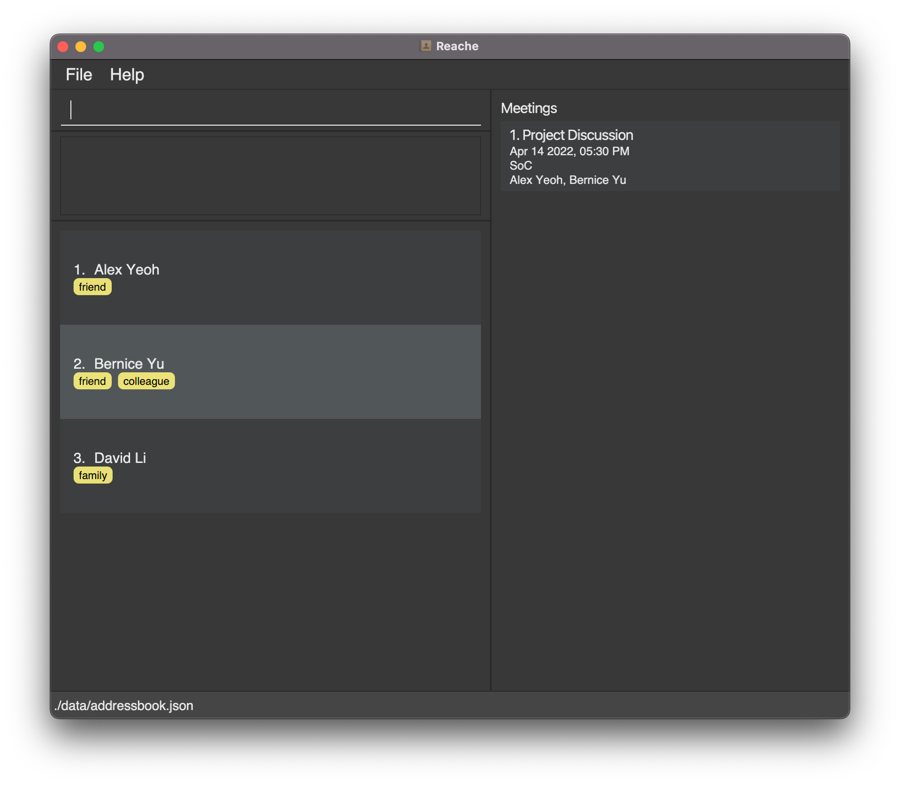

Reache is a desktop app that helps busy working professionals manage their large list of contacts by providing an easy-to-use interface to store contacts and organize meetings. Reache is especially suited for professionals who would like to optimize their contact management by using a Command Line Interface (CLI).

## Table of Contents
- [Quick Start](#1-quick-start)
- [Features](#2-features)
   - [Managing Contacts](#21-managing-contacts)
   - [Finding Contacts](#22-finding-contacts)
   - [Editing Information](#23-editing-information)
   - [Viewing Help](#24-viewing-help-help)
   - [Exiting the program](#25-exiting-the-program-exit)
- [Command Summary](#3-command-summary)
- [Contact Fields Summary](#4-contact-fields-summary)

--------------------------------------------------------------------------------------------------------------------

## 1. Quick start

1. Ensure you have Java `11` or above installed in your Computer.

1. Download the latest `reache.jar` from [here](https://github.com/AY2122S2-CS2103T-W12-4/tp/releases).

1. Copy the file to the folder you want to use as the _home folder_ for your Reache.

1. Double-click the file to start the app. The GUI similar to the below should appear in a few seconds [Disclaimer: Actual GUI not shown]. Note how the app contains some sample data. 
   

1. Refer to the Features below for details of each command.

--------------------------------------------------------------------------------------------------------------------

## 2. Features
### 2.1 Managing Contacts
#### 2.1.1 Adding a contact: `add`
Adds a person to the contact list.

Format: `add n/<NAME>`

After adding a person to the contact list, you will be navigated to their contact details page. 
From this page, you can edit their contact details using the commands found under the [Editing Information](#23-editing-information) section.

Example: `add n/Alex Dunphy`

#### 2.1.2 Clearing all contacts: `clear`
Clears all contacts from the address book.

Format: `clear`

#### 2.1.3 Deleting a contact: `del`
Deletes the specified person from the address book.

Format: `del <INDEX NO>`

Example: `del 66`

#### 2.1.4 Editing a contact: edit
Enters editing mode to modify contact details in the address book.

Format: `edit <ANY NUMBER AND TYPE OF FIELDS IN ANY ORDER> `

Information about the details that can be added is found under the [Editing Information](#23-editing-information) section.

Example: `edit 4`

#### 2.1.5 Editing the data file
_Reache_ data is saved as a JSON file at [_Reache_ Jar file location]/data/reache.json. Advanced users are welcome to update data directly by editing the data file.

#### 2.1.6 Saving changes
_Reache_ saves to the hard disk automatically after any command is issued that changes the data. There is no need to save manually.

### 2.2 Finding Contacts
#### 2.2.1 Finding contacts: `find`
Finds a person based on a search field and keywords provided. Searchable categories can be found in the [Editing Information](#23-editing-information) section.

Format: `find <OPTIONAL_FIELD> <KEYWORDS>`

Examples: 
`find c/Tesla SpaceX` Finds all contacts who work in `Tesla` or `SpaceX`. 
`find n/Katy Cathy Cate` Finds all contacts with the name `Katy` or `Cathy` or `Cate`. 
`find t/supplier` Finds all contacts who are tagged as `Supplier`.  
`find Alexandra` Finds all contacts who have `Alexandra` somewhere in their contact information.

**Note: `find` expects at least one keyword to match.**

#### 2.2.2 Listing all contacts: `list`
Shows a list of all contacts in the address book.

Format: `list`

#### 2.2.3 Viewing a person's full details: `view`
Displays the specified person's contact information and allows the contact to be edited.

Format: `view <INDEX NO>`

Example: `view 34`

#### 2.2.4 Returning after viewing a person's full details: `back`
Returns to the list of all contacts after viewing and/or editing a person's contact details.

Format: `back`

### 2.3 Editing Information
*Note:*
1. To edit existing information, adding a new entry with the same category/label as the existing entry will overwrite it with the new one. 
2. Difference between tags and labels: Labels distinguish multiple entries in the same field whereas tags group together any number of contacts based on some criterion.

#### 2.3.1 Symbols Legend

| Symbol | Meaning |
| --- | --- | 
| ... | Indicates that the preceding entry can be provided multiple times. |
| / | Used to indicate a label for the preceding field.   Labels are optional and if not provided, a default label will be assigned.   E.g. `ph/ 12345678 l/personal` labels the given number as "personal". |
| <...> | Indicates the argument that the user should provide in that area |

#### 2.3.2 Add/Edit phone numbers: phone
Format: `ph/<NUMBER 1> l/<LABEL> ph/<NUMBER 2> l/<LABEL>...`

Example: `ph/8765432 l/Personal ph/9753468 l/Office`

#### 2.3.3 Add/Edit emails: `email`
Format:  `e/<EMAIL 1> l/<LABEL> e/<EMAIL 2> l/<LABEL>...`

Example: `e/alex@reache.com l/Official; e/alex98@gmail.com`

#### 2.3.4 Add/Edit address: `address`

Format: `a/<ADDRESS 1> l/<LABEL>; a/<ADDRESS 2> l/<LABEL>...`

Example: `a/28 Francis Mine, Sacramento, CA - 654321 l/Home`  

#### 2.3.5 Add/Edit company: `company`

Format: `c/<COMPANY>`

Example: `c/Tesla`

#### 2.3.6 Add/Edit job title: `job`

Format: `j/<JOB TITLE>`

Example: `j/Software Engineer` 

#### 2.3.7 Add/Edit tags: `tag`

Format: `t/<TAG 1> t/<TAG 2>...`

Example: `t/Media Contact t/Has kids`

#### 2.3.8 Add/Edit pronoun: `pronoun`

Format: `pr/<PRONOUN 1> pr/<PRONOUN 2>...`

Example: `pr/He pr/Him`

#### 2.3.9 Delete field: `del`

Format: `del <TYPE> <LABEL>`

`<TYPE>` refers to the category of information you wish to delete, as indicated by its command word.

Without a `<LABEL>`, the command will delete all information stored in `<TYPE>`.

Examples:

`del p/ personal` -    Deletes the personal phone number of the contact.

`del a/` -         Deletes all addresses of the contact.

`del e/ Official` -   Deletes the Official email of the contact.
   
#### 2.4 Viewing help: `help`
Shows a message explaining how to access the help page.

Format: `help`
   
#### 2.5 Exiting the program: `exit`
Exits the program.

Format: `exit`

## 3. Command Summary

| **Action** | **Format, Example** |
| --- | --- |
| **Add** | Format: `add n/<NAME>`   Example: `add n/Alex Dunphy` |
| **Edit** | Format: `edit <ANY NUMBER AND TYPE OF FIELDS IN ANY ORDER>`   Example: `edit n/Michael J Wolf pr/her j/Farmer c/FarmingInc ph/999 l/Police t/friend ph/123456` |
| **Save** | Format: `save` |
| **Delete** | **Deleting contacts**   Format: `del <INDEX NO>`   Example: `del 88`     **Deleting fields**   Format: `del <FIELD> <LABEL>`   Example: `del p/ personal` |
| **Clear** | Format: `clear` |
| **Find** | Format: `find <FIELD> <VALUE>`   Example: `find n/ Michael Scott` |
| **View** | Format: `view` |
| **List** | Format: `list` |
| **Help** | Format: `help` |

## 4. Contact Fields Summary

| **Field** | **Mandatory** | **Format, Example** |
| --- | --- | --- |
| **Name** | Yes | Format: `n/<NAME>`   Example: `n/Alex Dunphy` |
| **Phone Number** | No | Format: `ph/<NUMBER 1> l/<LABEL> ph/<NUMBER 2> l/<LABEL>...`   Example: `ph/98765432 l/Personal ph/9753468 l/Office` |
| **Email ID** | No | Format: `e/<EMAIL 1> l/<LABEL> e/<EMAIL 2> l/<LABEL>...`   Example: `e/alex@reache.com l/Official e/alex98@gmail.com` |
| **Address** | No | Format: `a/<ADDRESS 1> l/<LABEL> a/<ADDRESS 2> l/<LABEL>...`   Example: `a/28 Francis Mine, Sacramento, CA - 654321 l/Home` |
| **Company** | No | Format: `c/<COMPANY>`   Example: `c/Tesla` |
| **Job Title** | No | Format: `j/<JOB TITLE>`   Example: `j/Software Engineer` |
| **Tags** | No | Format: `t/<TAG 1> t/<TAG 2>...`   Example: `t/MediaContact t/HasKids` |
| **Pronouns** | No | Format: `pr/<PRONOUNS>`   Example: `pr/They pr/Them` |

[Back to top](#table-of-contents)
