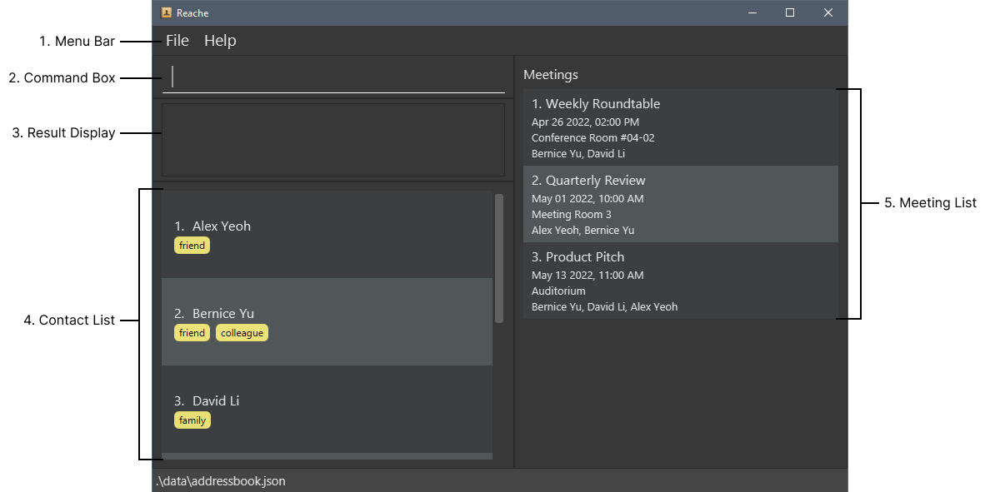
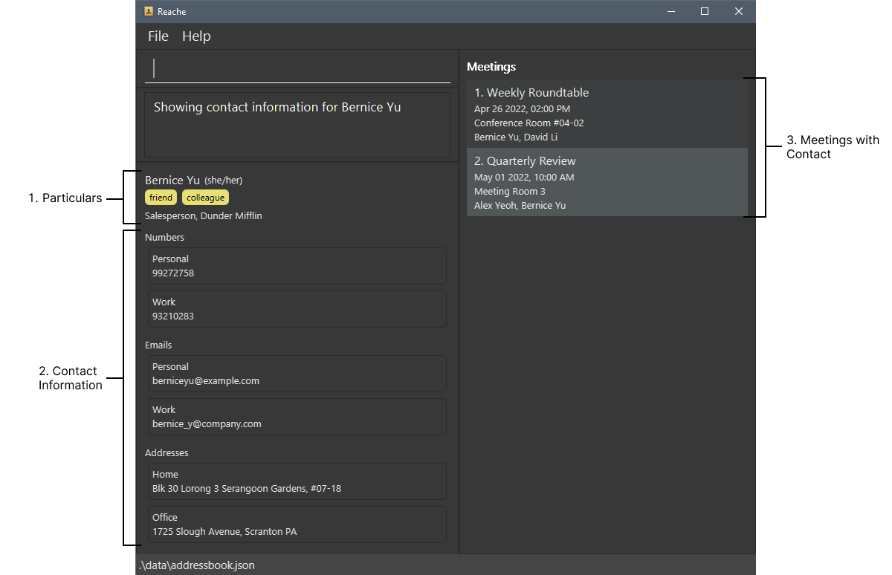
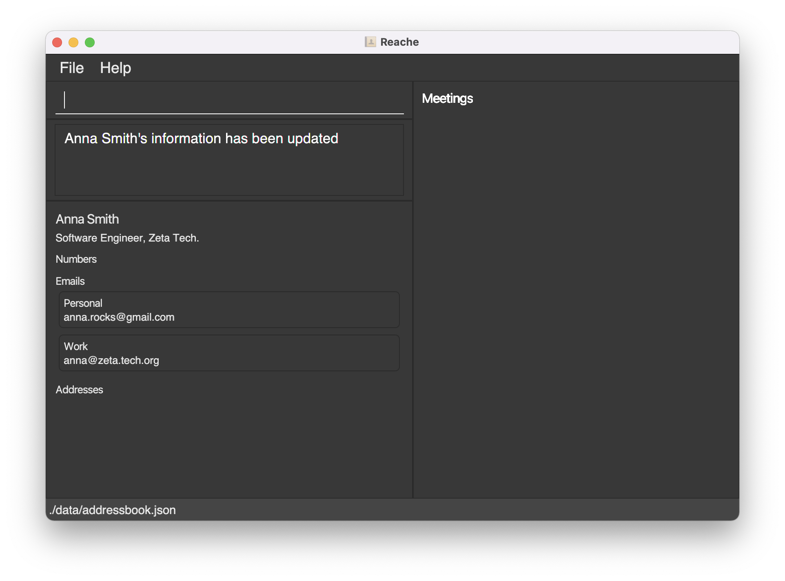
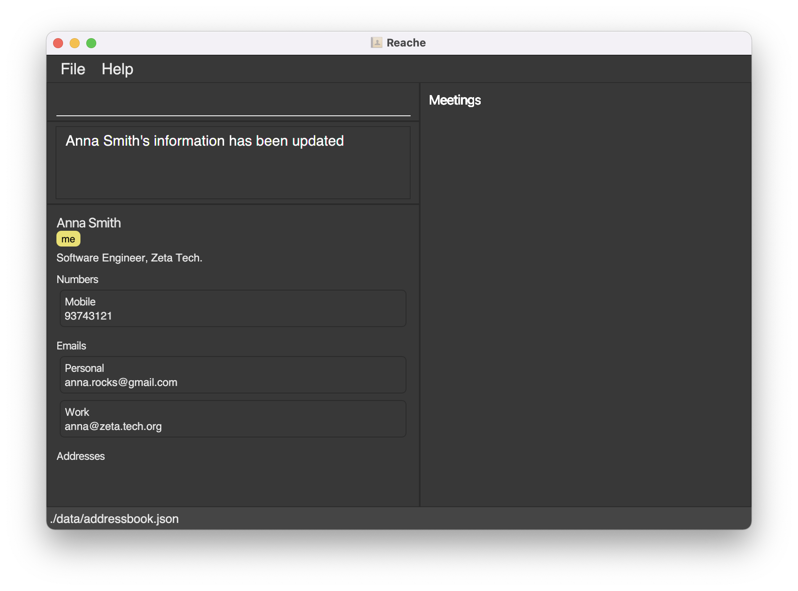
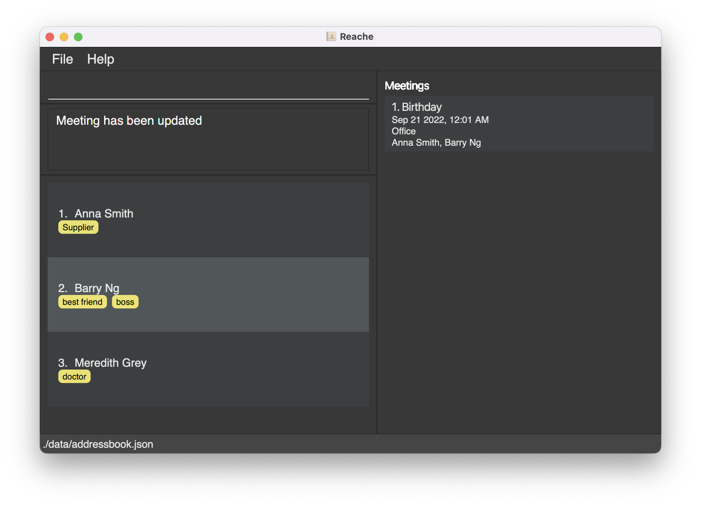
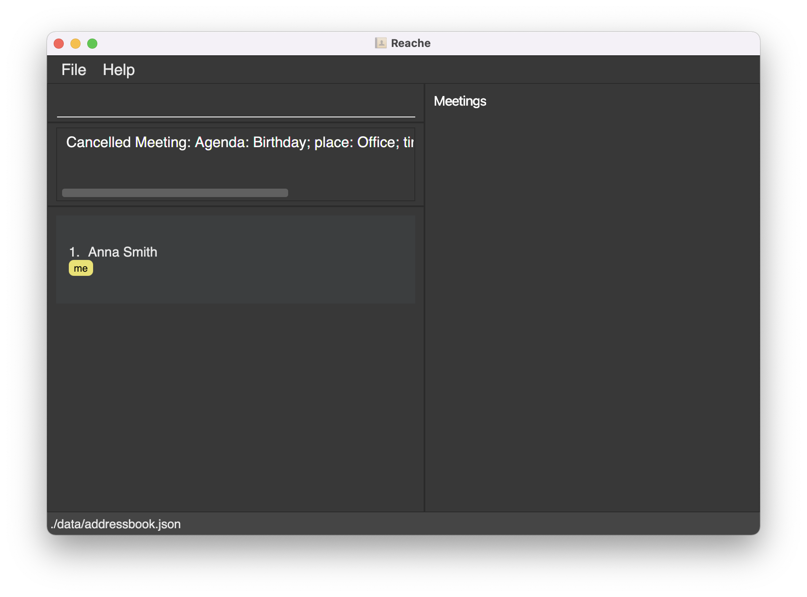

Reache is a desktop app that helps busy working professionals manage their large list of contacts by providing an easy-to-use interface to store contacts and organize meetings. Reache is especially suited for professionals who would like to optimize their contact management by using a Command Line Interface (CLI).

This guide will familiarize you with Reache's interface and features, and provide you all the information you need to begin using Reache.
* Table of Contents
{:toc}

--------------------------------------------------------------------------------------------------------------------

## 1. Quick start

1. Ensure you have Java `11` or above installed in your Computer.

2. Download the latest `reache.jar` from [here](https://github.com/AY2122S2-CS2103T-W12-4/tp/releases).

3. Copy the file to the folder you want to use as the _home folder_ for your Reache.

4. Double-click the file to start the app. The GUI similar to the below should appear in a few seconds. 

   

5. Refer to the [Features](#3-features) below for details of each command.

--------------------------------------------------------------------------------------------------------------------

## 2. Introduction
### 2.1 Overview
Reache is a contact manager application that helps you:
- Store and organize contacts
- Easily sort and search through your contact list
- Plan and keep track of upcoming meetings

 

### 2.2 Interface Guide
Reache uses **two windows**, the [Main Window](#221-main-window) and the 
[Contact Details Window](#222-contact-details-window) as a means of maintaning **information segregation**. 
The `Main Window` displays only the `names` and `tags` which is our predetermined basic requirement for 
contact identification, while the `Contact Details Window` displays the more detailed information inside a 
specific contact. You could imagine this layout as **resembling looking through a folder with small identification 
tags sticking out and only pulling out the document with the tag when you want to view its details**. This would help 
to save space on the main window as well as preventing information overload.

#### 2.2.1 Main Window
Upon launching Reache, you will see the Main Window, which is depicted below. The Main Window displays your entire contact list as well as all upcoming meetings you have planned.

The Main Window contains the following elements:
1. **Menu Bar**: Contains Reache's options and help.
2. **Command Box**: A dialog box from which you can type commands to use Reache.
3. **Result Display**: When you use the Command Box to enter a command, Reache will show the result of that command here.
4. **Contact List**: A list of all your contacts, sorted alphabetically. Each contact has a corresponding index number, which you can use to refer to that contact in commands.
5. **Meeting List**: A list of all your upcoming meetings, sorted chronologically. As with contacts, each meeting has a corresponding index number for use in commands.

 

#### 2.2.2 Contact Details Window
The Contact Details Window, which is depicted below, displays all the contact information associated with a specific contact.

The Contact Details Window contains many of the same elements as the Main Window, like the Menu Bar, Command Box, and Result Display. In addition, it contains the following elements:
1. **Particulars**: Consists of their name, pronouns, job title, company, and tags. Tags are descriptive keywords that help you identify a person. For example, you might assign a contact the tag “Friend” to indicate that they are your friend.

2. **Contact Information**: A contact's phone numbers, email addresses, and physical addresses. Reache lets you assign *custom labels* to these fields to help you organize a contact's information. For example, a person might have a *personal* phone number and an *office* phone number.

3. **Meetings with Contact**: Whereas the Meeting List in the Main Window displays all your upcoming meetings, the Contact Details Window only displays upcoming meetings that involve the contact being viewed.

Now that you are familiar with Reache's interface, we recommend visiting [Getting Started With Reache](#23-getting-started-with-reache) to begin using the application.

 

### 2.3 Getting Started with Reache

If you are a first time user of Reache, we highly recommend following these two step-by-step tutorials to get familiar 
with the product. 

In the [contacts tutorial](#231-tutorial-1-managing-contacts-with-reache), you will learn how to add your contact information to Reache. 

In the [meetings tutorial](#232-tutorial-2-managing-meetings-with-reache), you will learn how to schedule and track your meetings using Reache.

Experienced users should skip this section.

 

#### 2.3.1 Tutorial 1: Managing Contacts with Reache

In this tutorial we will be adding your personal contact information to Reache.

1. Launch Reache from the folder in which it is located by double clicking on it. You will see the window shown below with some sample contacts.  

   Since this is the first time you are using Reache, it loads the sample contacts as there are no actual contacts stored. Let’s start storing some real contacts in it.   
2. Firstly, we have to clear the sample data first. Type `clear` in the command box and press Enter/Return. Press 'Yes’ when Reache asks for confirmation.   
3. Now that the sample data has been cleared, we can start adding some real contacts to it.   
4. Begin by typing `add n/<YOUR NAME>` in the command box. Press enter/return.   
5. You will be redirected to the **Contacts Details Window** as shown below: 

**Note**: `edit` commands can only be issued in the **Contacts Details Window.**   
6. Let’s add your company and job to it. Type `edit j/<YOUR JOB> c/<YOUR COMPANY>`. Again, press enter/return. You will see your newly entered information on the window, as shown below:

7. Let’s add your emails to it. Type `edit e/<YOUR PERSONAL EMAIL> l/Personal e/<YOUR WORK EMAIL> l/Work`. The updated contact details should look like this:

8. Let’s add your number to it. Type `edit ph/<YOUR MOBILE NUMBER> l/Mobile`.   
9. Finally tag yourself using `edit t/me`. Your final contact details window should look like this:

10. Now type `back` in the command box to return to the main window. Your **Main Window** should look like this:

11. Now type `view 1` in the command box to navigate to your contact details.   
12. Use more `edit` commands to edit your details as you wish. When you are done, type `back` to save the data and return to the Main Window.   
13. As additional practice, try adding more contacts using `add` and `edit`. When you are done, type `list` to view all saved contacts.

#### 2.3.2 Tutorial 2: Managing Meetings with Reache

Let’s see how you can manage your meetings with Reache. 

In this tutorial, you will be scheduling a meeting with yourself on your next birthday at 12:01 AM.

**Note**: You must have completed [Tutorial 1: Managing Contacts with Reache](#231-tutorial-1-managing-contacts-with-reache).

1. In the command box, type `find t/me` to find yourself in the contacts list. If you followed [Tutorial 1](#231-tutorial-1-managing-contacts-with-reache) correctly you should see your name as the first search result.   
2. Now, type `meet for/Birthday in/Office on/<YOUR BIRTHDAY IN DD-MM-YYYY> 00:01 with/1`.   
3. You will see your newly created meeting in the right panel, like so: 

4. Let's say you want to update your meeting to invite your best friend. Add their contact if you have not done so.   
5. Type `list` to see a list of all you contacts. 

As you can see, for this particular user, their best friend `Barry Ng` is at index position `2`. Similarly, find the position of yourself and your best friend.   
6. Type `update <BIRTHDAY MEETING INDEX> with/<YOUR INDEX> <YOUR BEST FRIEND'S INDEX>`. For example, this user would type `update 1 with/1 2`. The updated meeting panel should look like this:   

7. Let's say you change your mind and want to cancel this meeting.   
8. Type `cancel 1`. The meeting will disappear from the panel, like so:

Now you are all set to manage your contacts and meetings using Reache!

## 3. Features

**:information_source: Notes about the command format:** 

| Symbol | Meaning |
| --- | --- | 
| ... | Indicates that the preceding entry can be provided multiple times. |
| / | Used to indicate a label for the preceding field.   Labels are optional and if not provided, a default label will be assigned.   E.g. `ph/ 12345678 l/personal` labels the given number as "personal". |
| <...> | Indicates the field that the user should provide in that area |

- Words in `<UPPER_CASE>` are the fields to be supplied by the user.  
  e.g. in `add n/<NAME>`, `NAME` is a field which can be used as `add n/Alex Dunphy`.

- Items in square brackets are optional.  
  e.g `n/NAME [t/TAG]` can be used as `n/Alex Dunphy t/Likes Science` or as `n/Alex Dunphy`.

- Items with ... after them can be used multiple times including zero times.
  e.g. `[ph/<PHONE_NUMBER> l/<LABEL>]...` can be either ignored, or used as `ph/12345678 l/personal`, `ph/90123456 l/office ph/78901234` etc.

- Fields can be in any order.

- `l/` is used to label fields. They are optional.

### 3.1 Managing Contacts
#### 3.1.1 Adding a contact: `add`
Add a person to your contact list by specifying details such as:
- Name
- Job title
- Company
- Tag(s)
- Pronoun(s)
- Phone number(s) 
- Email address(es)
- Physical address(es)

_Note_: 
- When adding contacts, 'name' is the only compulsory field. 
- You can add optional labels to your contact's phone numbers, email ids and physical addresses.
- Command words for the fields that can be added are given under the [5. Contact Fields Summary](#5-contact-fields-summary) section.

Format: `add n/<NAME> [ph/<PHONE_NUMBER> l/<LABEL>]... [e/<EMAIL> l/<LABEL>]... [a/<ADDRESS> l/LABEL]... [t/TAG]...`

Example: `add n/Alex Dunphy t/friend`

 

#### 3.1.2 Editing a contact: `edit`
On the Contact Details Window, modify the details of the person displayed on the page. The fields that can be added/edited are given in the [5. Contact Fields Summary](#5-contact-fields-summary) section.

Format: `edit <ANY NUMBER AND TYPE OF FIELDS IN ANY ORDER> `

Example: `edit n/Alex ph/98765432 t/has kids`

_Note_: Editing a field with the same category/label as an existing entry will overwrite it with the new one.

 

#### 3.1.3 Deleting a field: `del <FIELDS>`
On the Contact Details Window, delete any specific contact information of the person by specifying the field (and label) you want to delete. Command words for the fields that can be deleted are given in the [5. Contact Fields Summary](#5-contact-fields-summary) section.

`<FIELD>` refers to the contact field you wish to delete, as indicated by its command word.
Without a `<LABEL>`, the command will delete all information stored in `<FIELD>`.

Format: `del <FIELD 1> [<LABEL 1>] [<FIELD 2> <LABEL 2>...]`

Examples:

`del ph/ personal` -    Deletes the personal phone number of the contact.

`del a/` -         Deletes **all** addresses of the contact.

`del e/ Official` -   Deletes the 'Official' email of the contact.

`del pr/ her` -   Deletes the 'her' pronoun of the contact.

 

#### 3.1.4 Deleting a contact: `del <INDEX>`
Delete a contact from your address book by specifying their index in the displayed contacts list.

Format: `del <INDEX NO>`

Example: `del 66`

 

#### 3.1.5 Clearing your address book: `clear`
Clear all your contacts and meetings from the address book.

Format: `clear`

:exclamation: **Caution:**
This action is irreversible.

 

#### 3.1.6 Editing the data file
_Reache_ data is saved as JSON files at `/data/addressbook.json` and `/data/meetingbook.json`. Advanced users are welcome to update data directly by editing the data file.
   

:exclamation: **Caution:**
If your changes to the data file makes its format invalid, _Reache_ will discard all data and start with empty data files at the next run.

 

#### 3.1.7 Saving changes
_Reache_ saves changes to the hard disk automatically after any command. So there is no need for you to save manually.

 

### 3.2 Finding Contacts
#### 3.2.1 Finding contacts: `find`
Find a person based on any contact field by providing search keywords. Searchable fields can be found in the [5. Contact Fields Summary](#5-contact-fields-summary) section.

_Note_: 
- **All** contact fields are searchable.
- `find` expects **at least one** keyword to match.

Format: `find <OPTIONAL_FIELD> <KEYWORDS>`

- The search is case-insensitive. e.g `bella` will match `BeLLa`.
- The order of the keywords does not matter. e.g. `Bella Hadid` will match `Hadid Bella`.
- Only full words will be matched e.g. `Bell` will not match `Bella`.
- Persons matching at least one keyword will be returned, e.g. `Bella Hadid` will return `Gigi Hadid`, `Bella Swann`.
- In case the field is not specified/invalid, all fields are searched.

Examples: 
`find c/Tesla SpaceX` Finds all contacts who work in `Tesla` or `SpaceX`. 
`find n/Katy Cathy Cate` Finds all contacts with the name `Katy` or `Cathy` or `Cate`. 
`find t/supplier` Finds all contacts who are tagged as `Supplier`.  
`find Alexandra` Finds all contacts who have `Alexandra` somewhere in their contact information for any of their fields.

 

#### 3.2.2 Listing all contacts: `list`
View a list of all your contacts in the address book.

Format: `list`

 

#### 3.2.3 Viewing a person's full details: `view`
View a certain contact's information and your meetings with them by specifying their index in the displayed contacts list. This will take you to the Contact Details Window and allow you to edit their fields as well.

Format: `view <INDEX NO>`

Example: `view 34`

 

#### 3.2.4 Returning after viewing a person's full details: `back`
Return to the Main Window after viewing and/or editing a person's details from the Contact Details Window.

Format: `back`

 

### 3.3 Managing Meetings
#### 3.3.1 Creating a meeting: `meet`
Create a meeting by specifying the following information:
- Agenda
- Meeting place
- Meeting date and time: in DD-MM-YYYY HH:mm format
- Attendees: in the form of index numbers of people on the displayed list

_Note:_ All fields are compulsory.

Format: `meet for/<AGENDA> in/<MEETING PLACE> on/<MEETING DATE AND TIME> with/<ATTENDEE 1 INDEX> [<ATTENDEE 2 INDEX>]…`

Example: `meet for/Project Discussion in/UTown on/28-04-2022 13:30 with/1 3 4`

 

#### 3.3.2 Updating meeting details: `update`
Update any of the meeting’s details by indicating the following:
- Meeting index: The index of the meeting you want to edit on the meetings list
- Any of the meeting details given under the [6. Meeting Fields Summary](#6-meeting-fields-summary).

Format: `update <MEETING INDEX> [in/<MEETING PLACE> on/<MEETING DATE AND TIME> with/<ATTENDEE 1 INDEX>...]`

Example: `update 2 in/COM2 on/29-04-2022 20:00`

 

#### 3.3.3 Canceling a meeting: `cancel`
Cancel a meeting by specifying its index on the meetings list.

Format: `cancel <MEETING INDEX>`

Example: `cancel 2`

 

#### 3.3.4 Canceling all meetings: `cancel-all`
Clear your meetings list by canceling all meetings.

Format: `cancel-all`

:exclamation: **Caution:**
This action is irreversible.

 

### 3.4 Viewing help: `help`
Find help by getting a weblink to the _Reache_ user guide with this command.

Format: `help`

 

### 3.5 Exiting the program: `exit`
Exit the _Reache_ application.

Format: `exit`

 

## 4. Command Summary

    
   
### Main Window  

| **Action**             | **Format & Example**                                                                                                                                   |
|------------------------|--------------------------------------------------------------------------------------------------------------------------------------------------------|
| **Add Contact**        | Format: `add n/<NAME>`   Example: `add n/Alex Dunphy`                                                                                               |
| **Delete Contact**     | Format: `del <INDEX NO>`   Example: `del 88`                                                                                                        |
| **Clear Address Book** | Format: `clear`                                                                                                                                        |
| **Find Contacts**      | Format: `find <FIELD> <VALUE>`   Example: `find n/ Michael Scott`                                                                                   |
| **View Contact**       | Format: `view <INDEX>`   Example: `view 5`                                                                                                          |
| **List**               | Format: `list`                                                                                                                                         |
| **Create Meeting**     | Format: `meet <ALL FIELDS IN ANY ORDER>`   Example: `meet for/Project Discussion in/UTown on/28-04-2022 13:30 with/1 3 4`                           |
| **Update Meeting**     | Format: `update <MEETING INDEX> <ANY FIELDS IN ANY ORDER>`   Example: `update 2 in/COM2 on/29-04-2022 20:00`                                        |
| **Cancel Meeting**     | **Cancel specific meeting**   Format: `cancel <MEETING INDEX>`   Example: `cancel 2`     **Cancel all meetings**   Format: `cancel-all` |
| **Help**               | Format: `help`                                                                                                                                         |
| **Exit**               | Format: `exit`                                                                                                                                         |

### Contact Details Window 
  
| **Action**              | **Format & Example**                                                                                                                                              |
|-------------------------|-------------------------------------------------------------------------------------------------------------------------------------------------------------------|
| **Edit Contact Info**   | Format: `edit <ANY NUMBER AND TYPE OF FIELDS IN ANY ORDER>`   Example: `edit n/Michael J Wolf pr/her j/Farmer c/FarmingInc ph/999 l/Police t/friend ph/123456` |
| **Delete Contact Info** | Format: `del <ANY NUMBER AND TYPE OF FIELDS IN ANY ORDER>`   Example: `del ph/ personal e/`                                                                    |
| **Back**                | Format: `back`                                                                                                                                                    |
| **Help**                | Format: `help`                                                                                                                                                    |
| **Exit**                | Format: `exit`                                                                                                                                                    |

 

## 5. Contact Fields Summary

| **Field**            | **Mandatory** | **Format & Example**                                                                                                           |
|----------------------|---------------|--------------------------------------------------------------------------------------------------------------------------------|
| **Name**             | Yes           | Format: `n/<NAME>`   Example: `n/Alex Dunphy`                                                                               |
| **Phone Number**     | No            | Format: `ph/<NUMBER 1> l/<LABEL> ph/<NUMBER 2> l/<LABEL>...`   Example: `ph/98765432 l/Personal ph/9753468 l/Office`        |
| **Email Address**    | No            | Format: `e/<EMAIL 1> l/<LABEL> e/<EMAIL 2> l/<LABEL>...`   Example: `e/alex@reache.com l/Official e/alex98@gmail.com`       |
| **Physical Address** | No            | Format: `a/<ADDRESS 1> l/<LABEL> a/<ADDRESS 2> l/<LABEL>...`   Example: `a/28 Francis Mine, Sacramento, CA - 654321 l/Home` |
| **Company**          | No            | Format: `c/<COMPANY>`   Example: `c/Tesla`                                                                                  |
| **Job Title**        | No            | Format: `j/<JOB TITLE>`   Example: `j/Software Engineer`                                                                    |
| **Tags**             | No            | Format: `t/<TAG 1> t/<TAG 2>...`   Example: `t/MediaContact t/HasKids`                                                      |
| **Pronouns**         | No            | Format: `pr/<PRONOUNS>`   Example: `pr/They pr/Them`                                                                        |

 
   
## 6. Meeting Fields Summary

| **Field**         | **Mandatory** | **Format & Example**                                                                |
|-------------------|---------------|-------------------------------------------------------------------------------------|
| **Agenda**        | Yes           | Format: `for/<AGENDA>`   Example: `for/Project Consulation`                      |
| **Meeting Place** | Yes           | Format: `in/<MEETING PLACE>`   Example: `in/Zoom`                                |
| **Meeting Time**  | Yes           | Format: `on/<MEETING TIME AS DD-MM-YYYY HH:mm>`   Example: `on/14-04-2022 14:00` |
| **Attendees**     | Yes           | Format: `with/<ATTENDEE 1 INDEX>...`   Example: `with/1 3 5`                     |
