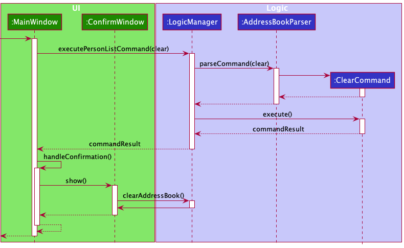
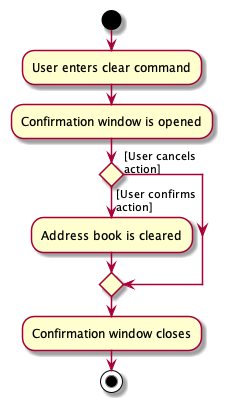

### Project: Reache

_Reache_ is a desktop address book application used for teaching Software Engineering principles. The user interacts
with it using a CLI, and it has a GUI created with JavaFX. It is written in Java, and has about 20 kLoC.

## Summary of Contribution

* **Code Contributed**: [RepoSense Link](https://nus-cs2103-ay2122s2.github.io/tp-dashboard/?search=ckcherry23&breakdown=true&sort=groupTitle&sortWithin=title&since=2022-02-18&timeframe=commit&mergegroup=&groupSelect=groupByRepos&checkedFileTypes=docs~functional-code~test-code~other)


* **Enhancements Implemented**:
  * Implemented storage functionality for the meetings list and for the new attributes in persons list:
    [#44](https://github.com/AY2122S2-CS2103T-W12-4/tp/pull/44),
    [#122](https://github.com/AY2122S2-CS2103T-W12-4/tp/pull/122).

  * Implemented a new feature to `delete` specific fields of a contact and added tests for it:
    [#81](https://github.com/AY2122S2-CS2103T-W12-4/tp/pull/81),
    [#229](https://github.com/AY2122S2-CS2103T-W12-4/tp/pull/229).

  * Enhanced the `clear` command by asking for user confirmation. Created a new `ConfirmWindow` with reusability in 
    mind for any future commands that require user confirmation:
    [#82](https://github.com/AY2122S2-CS2103T-W12-4/tp/pull/82).

  * Enhanced the `help` command by opening the user guide directly from the _Help Window_ rather than allowing the user 
    to copy the user guide URL to improve UX:
    [#36](https://github.com/AY2122S2-CS2103T-W12-4/tp/pull/36).

  * Implemented the `back` command that takes the user back to the _Home Page_ from the _Contact Details Page_:
    [#76](https://github.com/AY2122S2-CS2103T-W12-4/tp/pull/76).
  
  * Implemented changes to allow creation of contacts with the same name as long as tags are different. This takes into 
    consideration that multiple contacts may have the same full name, but still helps us keep our contacts unique:
    [#96](https://github.com/AY2122S2-CS2103T-W12-4/tp/pull/96).
  
  * Implemented setting focus to the command box after navigation to decrease number of mouse clicks and improve UX:
    [#131](https://github.com/AY2122S2-CS2103T-W12-4/tp/pull/131).
  
  * Fixed tests after the implementation of multiple fields for phones, addresses and emails: 
    [#39](https://github.com/AY2122S2-CS2103T-W12-4/tp/pull/39),
    [#46](https://github.com/AY2122S2-CS2103T-W12-4/tp/pull/46).
  
  * Updated the GUI color scheme: 
    [#218](https://github.com/AY2122S2-CS2103T-W12-4/tp/pull/218).


* **Contributions to the UG**: 
  * Added the `Managing Meetings` section under `Features`: 
    [#146](https://github.com/AY2122S2-CS2103T-W12-4/tp/pull/146).
  
  * Created the tables for `Commands Summary`, `Contact Fields Summary` and `Meeting Fields Summary`:
    [#10](https://github.com/AY2122S2-CS2103T-W12-4/tp/pull/10),
    [#146](https://github.com/AY2122S2-CS2103T-W12-4/tp/pull/146).


* **Contributions to the DG**: 
  * Added the `Delete fields feature` under `Implementation` along with its design decisions:
    [#104](https://github.com/AY2122S2-CS2103T-W12-4/tp/pull/104).
  
  * Added the `Clear address book feature` under `Implementation` along with its sequence diagram and activity diagram:
    [#111](https://github.com/AY2122S2-CS2103T-W12-4/tp/pull/111).
  
  * Mentioned the `Non-functional requirements` of the project and added a `Glossary` for better user readability:
    [#21](https://github.com/AY2122S2-CS2103T-W12-4/tp/pull/21).

  * Added instructions for manually testing the `Saving data`, `Deleting fields`, and 
    `Clearing contacts and/or meetings` features: 
    [#265](https://github.com/AY2122S2-CS2103T-W12-4/tp/pull/265),
    [#279](https://github.com/AY2122S2-CS2103T-W12-4/tp/pull/279).


* **Contributions to the team-based tasks**:
  * Managed [labels](https://github.com/AY2122S2-CS2103T-W12-4/tp/labels) for issue-tracking and PRs.
  
  * Set up milestones [v1.1](https://github.com/AY2122S2-CS2103T-W12-4/tp/milestone/1), 
    [v1.2](https://github.com/AY2122S2-CS2103T-W12-4/tp/milestone/2), 
    [v1.2b](https://github.com/AY2122S2-CS2103T-W12-4/tp/milestone/3), 
    [v1.3b](https://github.com/AY2122S2-CS2103T-W12-4/tp/milestone/5) and 
    [v1.4](https://github.com/AY2122S2-CS2103T-W12-4/tp/milestone/6) on the issue-tracker.
  
  * Set up GitHub Project boards with the _automated kanban with reviews_ template for 
    [v1.1](https://github.com/AY2122S2-CS2103T-W12-4/tp/projects/1),
    [v1.2](https://github.com/AY2122S2-CS2103T-W12-4/tp/projects/3),
    [v1.3](https://github.com/AY2122S2-CS2103T-W12-4/tp/projects/4),
    [v1.4](https://github.com/AY2122S2-CS2103T-W12-4/tp/projects/6).
  
  * Updated the product scope in the UG, website home page and README.md:
    [#9](https://github.com/AY2122S2-CS2103T-W12-4/tp/pull/9).


* **Review/mentoring contributions**: 
  * Gave 87 comments on _others'_ PRs to detect bugs and ensure consistency in design and implementation: 
    [tP Comments Link](https://nus-cs2103-ay2122s2.github.io/dashboards/contents/tp-comments.html#11-char-usar-ckcherry23-87-comments)
  
  * Some PRs reviewed with meaningful comments:
    [#110](https://github.com/AY2122S2-CS2103T-W12-4/tp/pull/110),
    [#118](https://github.com/AY2122S2-CS2103T-W12-4/tp/pull/118),
    [#142](https://github.com/AY2122S2-CS2103T-W12-4/tp/pull/142).


* **Contributions beyond the project team**: 
  * Posted [14 issues](https://github.com/ckcherry23/ped/issues) 
    for [LinkyTime](https://github.com/AY2122S2-CS2103T-T13-3/tp) during the PE-D

<br>
<div style="page-break-after: always;"></div>

* **Contributions to the Developer Guide (Extracts)**:

```markdown
### 5.3 Delete fields feature
The **delete fields** feature can be used to delete fields stored for the
contacts. This feature is also restricted to the Contact Details Page,
which can be accessed after the _add_ or _view_ commands. It is mainly
facilitated by the `ContactDetailsPageParser`, `DeleteFieldCommandParser`
and `DeleteFieldCommand` classes.

_Note:_ This feature is different from the **delete contacts** feature,
which is only accessible on the Home Page.

#### 5.3.1 Design considerations:
Since certain fields allow for multiple values to be stored, the user needs
to specify the label of the value (or the value itself for non-labelled
fields) they want to delete along with the field to be deleted for such
fields.

**Aspect: What happens when the user does not specify a label or value:**

* **Alternative 1 (current choice):** Delete all the values stored for this
  field immediately.
  * Pros:
    * Seems to be the most intuitive approach.
    * Easier to implement.
    * Faster to execute command.
  * Cons:
    * User may have forgotten to mention the label or field, which could
      lead to unintended loss of data.

* **Alternative 2 :** Confirm that the user wants to delete all values for
  this field
  * Pros:
    * Allows user to cancel the command if it was unintentional.
  * Cons:
    * Slower to execute command.
    * Difficult to implement, since the current implementation does not
      store command history.

We picked _alternative 1_ since the focus of our CLI app is on speed and
efficiency. Additionally, _alternative 2_ required a lot of changes to the
existing implementation which would not be very helpful for executing other
commands.
```

<div style="page-break-after: always;"></div>

```markdown
### 5.4 Clear all data feature
The **clear all data** feature can be used to delete all the contacts
and meetings stored by the user. Since deleted data cannot be recovered,
the app opens a pop-up window asking for user confirmation before any
data is cleared.

The following sequence diagram shows how the clear operation works:



This activity diagram summarises the possible paths of executing the _clear_
command:


```
<br> 

**Sequence Diagram: `clear`**


<br>
<div style="page-break-after: always;"></div>

```markdown
### 8.4 Deleting fields
1. Deleting only particular fields of a contact

   1. Prerequisites: Have at least one contact stored with multiple phone 
      numbers, tags, pronouns and the job title and view their details with
      the `view <INDEX NO>` command. These test cases must be followed in 
      order.

   2. Test case: `del` <br>
      Expected: No field is deleted. An error message is shown in the status
      box.

   3. Test case: `del ph` <br>
      Expected: No field is deleted. An error message is shown in the status
      box.

   4. Test case: `del ph/ <LABEL OF FIRST PHONE NUMBER>` <br>
      Expected: The first phone number is deleted while the rest are still 
      displayed in the contact details.

   5. Test case: `del t/` <br>
      Expected: All the tags of the person displayed are deleted. <br>
      Exception: If there is another contact with the same name as this 
      contact but without any tags, this command will result in an error
      and no fields will be deleted.

   6. Test case: `del pr/ j/` <br>
      Expected: All the pronouns and the job title of the person displayed
      are deleted.

   7. Test case: `del j/` <br>
      Expected: No field is deleted. An error message is shown in the status
      box.
```

<br>
<div style="page-break-after: always;"></div>

* **Contributions to the User Guide (Extracts)**: 

```markdown
#### 3.3.1 Creating a meeting: `meet`
Create a meeting by specifying the following information:
- Agenda
- Meeting place
- Meeting date and time: in DD-MM-YYYY HH:mm format
- Attendees: in the form of index numbers of people on the displayed list

_Note:_ All fields are compulsory.

Format: `meet for/<AGENDA> in/<MEETING PLACE> on/<MEETING DATE AND TIME> 
with/<ATTENDEE 1 INDEX> [<ATTENDEE 2 INDEX>]…`

Example: `meet for/Project Discussion in/UTown on/28-04-2022 13:30 with/1 3 4`
```

```markdown
#### 3.3.2 Updating meeting details: `update`
Update any of the meeting’s details by indicating the following:
- Meeting index: The index of the meeting you want to edit on the meetings 
  list
- Any of the meeting details given under 
  [6. Meeting Fields Summary](#6-meeting-fields-summary).

Format: `update <MEETING INDEX> [in/<MEETING PLACE> on/<MEETING DATE AND 
TIME> with/<ATTENDEE 1 INDEX>...]`

Example: `update 2 in/COM2 on/29-04-2022 20:00`
```

```markdown
#### 3.3.3 Canceling a meeting: `cancel`
Cancel a meeting by specifying its index on the meetings list.

Format: `cancel <MEETING INDEX>`

Example: `cancel 2`
```

```markdown
#### 3.3.4 Canceling all meetings: `cancel-all`
Clear your meetings list by canceling all meetings.

Format: `cancel-all`

<div markdown="span" class="alert alert-warning">:exclamation: **Caution:**
This action is irreversible.
</div>
``` 
